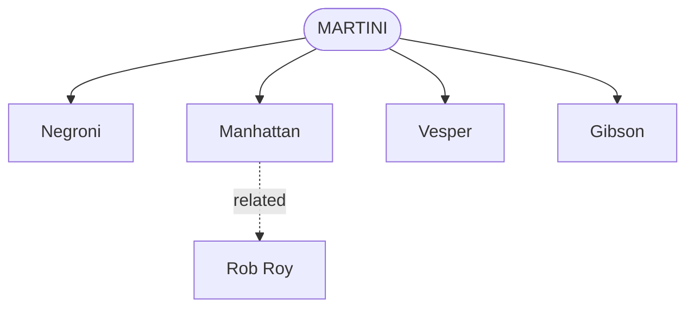

# Families Map — Requirements

## Summary

Redesign `/families` from its current card grid into a per-family branching map styled after the *Cocktail Codex* family drawings: each root family is shown one at a time, with its member recipes branching out from a central root node, and the branches/arrows drawing themselves in as the family scrolls into view. Nav controls hop between the six roots. The map is the flagship instance of a bar-craft motif + motion language the site can extend later — but v1 is `/families` only.

## Problem Frame

Issue #10 flags the site as feeling generic. Most of that brief is already answered: the type pairing (Fraunces / Newsreader), the parchment-and-terracotta palette, and the dark header treatment give the site a committed identity. The remaining gap #10 itself names last is a motif tied specifically to cocktails, and layouts that break from default recipe-site convention.

`/families` today is a flat grid of six cards — structurally identical to every other browse page (`by-spirit`, `by-flavor`, etc.). It states that six root families exist but shows nothing about how recipes relate to them. The *Cocktail Codex* framework the page already cites is inherently visual — root plus radiating variations — and rendering it as undifferentiated cards throws away the one place the site has a genuinely distinctive, ownable visual concept.

## Key Decisions

- **Per-family branching map, not a unified constellation or an authored genealogy.** The data is root→members (a recipe lists one or more of the six `families`), plus `related[]` sibling links. *Cocktail Codex* presents one family per spread — "root plus ~3 variations," explicitly *not* a historical lineage. Per-family branching is faithful to both the book and the existing data, and needs zero schema change.
- **Second-tier depth comes from `related[]`, not new data.** To echo the book's occasional sub-branching, a member node may sub-branch to its `related[]` recipes that also belong to the same family. This adds visual depth without authoring any parent→child lineage.
- **"Built as you scroll" means draw-on-reveal per family, not one long scroll through all six.** A family's branches animate in when that family scrolls into view; switching families via nav re-runs the draw. This is the resolution of the original "see the tree built as you scroll" + "hop between families" instinct.
- **The motif is seeded here, extended later.** The node/branch visual vocabulary is designed to be reusable (dividers, section marks elsewhere), but v1 ships only the `/families` map.
- **Draws in the existing palette.** The map uses current design tokens (terracotta accent, parchment surfaces, Fraunces/Newsreader) — no new color or type work.

## Visualization

The shape for a single family in view (Martini shown; `related[]` sub-branch illustrated on Manhattan):

Bridge recipes — those listing two families (French 75 → daiquiri + whiskey-highball; Manhattan → martini + old-fashioned) — simply appear as members in each of their families' maps. No special cross-family edge in v1.

## Requirements

**Structure and data**

- R1. The map renders one family at a time: a central root node for the family, with each published recipe whose `families[]` includes that family as a branch node.
- R2. A branch node may sub-branch to recipes in its `related[]` that also belong to the family in view. Sub-branches are visually subordinate to top-level branches.
- R3. The map reads from existing content fields only (`families[]`, `related[]`). No new frontmatter field, no schema change.
- R4. Recipes belonging to two families appear as members in each of those families' maps. No dedicated cross-family connector in v1.
- R5. Branch and sub-branch nodes link to their recipe page; the root node is non-interactive (or links to the existing `/by-family/<slug>/` listing).

**Layout and visual language**

- R6. The map is styled after the *Cocktail Codex* family drawings — root-and-branches, drawn with SVG strokes/arrows — and uses the existing design tokens (terracotta accent, parchment surfaces, Fraunces/Newsreader). No new palette or type.
- R7. Branch layout adapts to member count (a family may have 1 or 8+ members) without overlap or clipping.
- R8. The node/branch visual primitives are built so the same vocabulary can later be reused elsewhere; no other page consumes them in v1.

**Motion and interaction**

- R9. When a family scrolls into view, its branches/arrows draw in (stroke animation). Switching the family in view re-runs the draw for the newly shown family.
- R10. Switching families is driven by nav controls covering all six roots; the current family is indicated.
- R11. Motion is purposeful and brief — the draw reveals structure, it does not gate access to the content (links are usable as soon as nodes are present).

**Accessibility and responsive**

- R12. Under `prefers-reduced-motion: reduce`, the map renders fully drawn with no stroke animation. (The repo already honors this query globally.)
- R13. On narrow viewports the map remains legible — branches stack/reflow vertically rather than requiring horizontal scroll.
- R14. The map is navigable and the recipe links reachable without relying on the animation having run.

**Empty-state**

- R15. The Flip family (currently zero members) renders as a labeled root with an empty/`is-empty` treatment consistent with the page's current handling — no dead links.

## Acceptance Examples

- AE1. Covers R9, R10. **Given** the Martini family is shown, **when** the user clicks the nav control for Daiquiri, **then** the Martini branches clear and the Daiquiri root + its member branches draw in.
- AE2. Covers R9, R12. **Given** the user has `prefers-reduced-motion: reduce`, **when** a family scrolls into view, **then** the full map is already drawn with no stroke animation.
- AE3. Covers R1, R4. **Given** the French 75 lists `families: [daiquiri, whiskey-highball]`, **when** either the Daiquiri or the Whiskey Highball family is shown, **then** French 75 appears as a branch in that family.
- AE4. Covers R2. **Given** Manhattan is a member of Martini and has a `related[]` entry that is also a Martini member, **when** the Martini family is shown, **then** that related recipe renders as a sub-branch off Manhattan.
- AE5. Covers R15. **Given** the Flip family has no published members, **when** it is selected, **then** it shows as a labeled root with the empty treatment and no clickable dead branches.
- AE6. Covers R13. **Given** a phone-width viewport, **when** a family with several members is shown, **then** branches reflow vertically and the map fits without horizontal scroll.

## Scope Boundaries

**Deferred for later**

- Extending the node/branch motif to other surfaces (section dividers, node marks on recipe or learn pages).
- A unified all-families constellation view (the "scroll through all six at once" alternative).
- Cross-family connector edges drawn between a bridge recipe's two families.

**Outside this brainstorm**

- A true multi-generation genealogy (root → variation → sub-variation) and the new `parent`-style field + per-recipe curation it would require — #10 puts schema rework out of scope, and the book itself is not a lineage.
- #10's other personalization tracks: recipe-page redesign, editorial-voice work, illustrated dividers as a system, and any rebrand/logo work.

## Dependencies / Assumptions

- Assumes the current `families[]` and `related[]` data is the full relationship model for v1; no content backfill is planned as part of this work.
- Assumes member counts per family stay small (single digits) at current collection size; R7's layout requirement is the hedge if a family grows large.
- Builds on the existing global `prefers-reduced-motion` handling rather than introducing a new motion-preference mechanism.

## Outstanding Questions

**Deferred to planning**

- SVG approach: hand-authored layout vs. a layout library vs. a lightweight graph helper — settle during planning against member-count and bundle-size constraints.
- Exact nav affordance (tabs, prev/next stepper, or a root selector) and whether the URL reflects the selected family.
- Whether the root node links to `/by-family/<slug>/` or is inert (R5 leaves both open).
