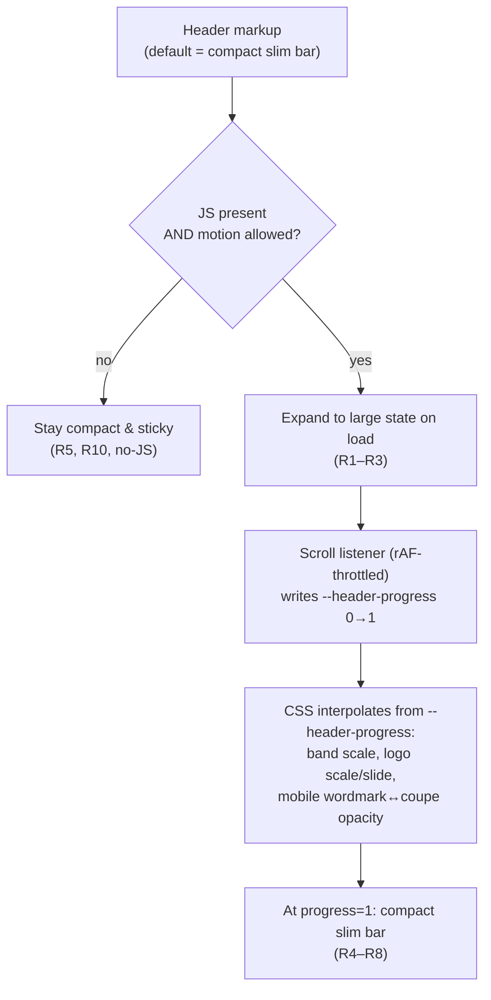

# feat: Collapsing logo header

## Summary

Turn the static header in `src/layouts/BaseLayout.astro` into a **collapsing header** used on every page: the brand logo shows large on load (full-width wordmark on mobile, centered wordmark on desktop) with the folder-tabs beneath it, then shrinks on scroll into the existing slim sticky bar (small logo left, tabs right). A small inline client script drives the shrink; reduced-motion and no-JS fall back to the compact header. Ship a resolution fix alongside so the mark renders crisp at every size.

## Problem Frame

The logo is a brand asset worth featuring, but today it sits small and left-aligned in a fixed slim header, treated as utilitarian chrome. Separately, it renders soft on mobile: the in-header coupe is generated at 80×80 (`src/layouts/BaseLayout.astro:29`) yet displayed at ~64px on retina screens that need 128–192px of source pixels. The source PNGs are high-resolution (`src/assets/brand/logo-coupe.png` 525×525, `src/assets/brand/logo-full.png` 1024×360), so the softness is purely an under-sized generated asset, not an art limitation (see origin: `docs/brainstorms/2026-05-28-collapsing-logo-header-requirements.md`).

---

## Requirements

Carried from the origin requirements doc.

**Large (hero) state**

- R1. On initial load of any page, the header renders in its large state: the brand wordmark displayed prominently with the folder-tabs beneath it.
- R2. On mobile (Compact, `<40rem`), the large state shows the full wordmark spanning the full width of the header.
- R3. On desktop (`≥40rem`), the large state shows the full wordmark at a generous size, horizontally centered.

**Collapse behavior**

- R4. As the user scrolls down, the header animates from large to compact — the logo scales down and the band shrinks — tracking scroll position.
- R5. The compact state matches today's slim header: small logo left, folder-tabs right, sticky to the top of the viewport.
- R6. The folder-tabs remain present and clickable through the entire animation — never disappearing or becoming unreachable at any scroll position.
- R7. On desktop the wordmark scales directly between large and small; on mobile the large wordmark crossfades into the compact coupe icon as the header collapses.
- R8. Scrolling back to the top reverses the animation, returning the header to its large state.

**Logo quality**

- R9. The logo renders crisply at every size and on high-DPI displays — both states, both breakpoints — sourced from the existing brand PNGs.

**Motion accessibility**

- R10. Under `prefers-reduced-motion: reduce`, the header does not animate on scroll; it presents a non-animated equivalent (the compact sticky header), consistent with the reduced-motion mandate in `docs/design/direction.md`.

---

## Key Technical Decisions

- **Continuous scroll-linked collapse, driven by a CSS custom property updated in JS.** A small inline script (`<script is:inline>`, mirroring `src/components/Search.astro`) listens to scroll inside a `requestAnimationFrame` throttle and writes a `--header-progress` value (`0` = fully large, `1` = fully collapsed) onto the header element. All visual interpolation (band height, logo scale, mobile crossfade opacity) is expressed in CSS as functions of that property. Chosen over pure CSS scroll-driven animations (`animation-timeline: scroll()`) because Safari does not ship them as of early 2026; the JS-var approach is cross-browser and keeps the math in one place. Chosen over an IntersectionObserver threshold-snap because the brainstorm calls for a shrink that tracks scroll, not a one-shot transition (see origin Key Decisions).
- **Compact static header is the baseline; the hero is progressive enhancement.** The header's default rendered state — before the script runs, with no JS, or under reduced-motion — is the compact slim bar (small logo left, tabs right), i.e. today's header. The script *expands* it to the large state on load when motion is allowed and JS is present, then binds the scroll collapse. This guarantees R10 and a no-JS fallback without a second code path, and avoids a flash-of-large-header on slow loads.
- **Only compositor-friendly properties animate.** `--header-progress` feeds `transform: scale()`/`translate()` and `opacity` (for the crossfade), never `height`/`top`/layout properties, so the shrink stays jank-free. The header reserves its collapsed height in normal layout and the large state overflows visually via transform, so collapsing does not reflow `<main>`.
- **One high-resolution webp per mark; CSS controls displayed size.** Replace the two fixed-size `getImage` calls with renders sized for the *largest* on-screen use at 2× density (full-width mobile hero for the wordmark; small collapsed icon at 2× for the coupe), generated from the existing source PNGs via Astro's `getImage`/`sharp`. Both states scale the same crisp asset down with CSS. No new artwork; the coupe/header seam re-export stays deferred.
- **Mobile crossfade rides the same progress value.** The wordmark and coupe are stacked in the mobile header; `--header-progress` cross-dissolves their opacities. Desktop renders only the wordmark and scales it, so no crossfade there.

---

## High-Level Technical Design

The header has one input — scroll progress — and three render paths gated by capability:

`--header-progress` is the single source of truth: `0` renders the large state, `1` renders the compact state, and intermediate values render the in-between frames. Tabs live in the same flex row in both states (anchored, never re-parented), satisfying R6 by construction.

---

## Implementation Units

### U1. Crisp logo assets

- **Goal:** Fix the soft logo (R9) independent of the layout work — the smallest shippable improvement, landable on its own.
- **Requirements:** R9.
- **Dependencies:** none.
- **Files:** `src/layouts/BaseLayout.astro` (the `getImage` calls at lines 28–29).
- **Approach:** Regenerate the wordmark and coupe webp at resolutions sized for their largest on-screen use at 2× density — the wordmark for the full-width mobile hero, the coupe for the small collapsed icon at 2×. Keep `format: 'webp'`. Let the existing/!new CSS (`height`-based sizing) scale them down; the displayed dimensions don't change in this unit, only the source pixel density. Confirm the generated asset widths comfortably exceed the largest CSS-displayed width × 2.
- **Patterns to follow:** existing `getImage` usage in the same file; `sharp` is already a dependency and backs Astro's asset pipeline.
- **Test scenarios:** Test expectation: none — asset-generation/config change with no behavioral logic. Verify visually (see Verification) rather than via unit test, consistent with the repo's script-only test suite and the styling/layout TDD exemption in `CLAUDE.md`.
- **Verification:** On a high-DPI display (or devtools 2–3× DPR emulation), the mobile coupe and desktop wordmark render sharp with no blurring; `npm run build` succeeds and emits the larger webp variants.

### U2. Two-state header structure and styling

- **Goal:** Build the large hero state and the compact state as one markup tree whose appearance is a function of `--header-progress`, with the compact state as the CSS default (progress unset/`1`). No scroll logic yet.
- **Requirements:** R1, R2, R3, R5, R6, R7 (static endpoints of the crossfade/scale).
- **Dependencies:** U1 (uses the crisp assets).
- **Files:** `src/layouts/BaseLayout.astro` (header markup + scoped `<style>`), `src/styles/global.css` (only if a new chrome token is genuinely needed; prefer reusing `--color-header-bg/-fg/-fg-muted`).
- **Approach:** Keep the existing dark header chrome (`--color-header-bg` `#1A1810`) per `docs/design/direction.md` "Header chrome". Restructure the header so the band height, logo scale, and logo position are expressed via `calc()`/`scale()` reading `var(--header-progress, 1)` — default `1` renders today's compact bar. At progress `0`: mobile shows the full-width wordmark with tabs beneath; desktop shows the centered wordmark with tabs beneath. Stack the wordmark and coupe in the mobile header (both present, opacity cross-tied to progress); desktop renders the wordmark only. Folder-tabs stay in the same flex container in both states so they are never re-parented (R6). Reserve the compact height in layout; the large state expands via transform so `<main>` does not reflow.
- **Patterns to follow:** existing folder-tab styles and `<picture>`/`getImage` logo handling in `BaseLayout.astro`; breakpoint at `40rem` per `docs/design/direction.md` "Responsive breakpoints".
- **Test scenarios:** Test expectation: none — pure layout/styling (TDD-exempt per `CLAUDE.md`). Covered by visual verification across breakpoints.
- **Verification:** With `--header-progress` forced to `0` in devtools, the large state matches the brainstorm mockups at mobile (full-width wordmark) and desktop (centered wordmark), tabs beneath, all on dark chrome; forced to `1`, it matches today's slim header. Tabs are clickable at both endpoints. `astro check` and `npm run build` pass.

### U3. Scroll-linked collapse behavior

- **Goal:** Animate between the two states by binding `--header-progress` to scroll, with the mobile crossfade and the reduced-motion / no-JS fallbacks.
- **Requirements:** R4, R6, R7, R8, R10.
- **Dependencies:** U2.
- **Files:** `src/layouts/BaseLayout.astro` (inline `<script is:inline>` + the progress-mapping helper).
- **Approach:** On load, if JS runs and `matchMedia('(prefers-reduced-motion: reduce)')` does *not* match, add a hook (e.g. a class/attribute) that lets the header expand to the large state, then bind a `requestAnimationFrame`-throttled scroll listener that computes progress from `scrollY` over a fixed collapse distance (the band's large-minus-compact height), clamped to `[0,1]`, and writes it to `--header-progress`. The CSS from U2 does the rest, including the mobile crossfade. Under reduced-motion or no JS, skip expansion entirely so the compact static header (R10) is what renders. Scrolling back to top returns progress to `0` (R8). Keep the listener passive and do no layout reads/writes beyond the single custom-property set.
- **Execution note:** Extract the pure `scrollY → progress` mapping (clamp over collapse distance) into a small standalone helper so it can be unit-tested without a DOM; keep the DOM wiring in the inline script.
- **Patterns to follow:** `<script is:inline define:vars={...}>` usage in `src/components/Search.astro`; reduced-motion handling already present in `src/styles/global.css` (`prefers-reduced-motion` block).
- **Test scenarios** (for the extracted mapping helper, mirroring `scripts/*.test.mjs` + Vitest):
  - Happy path: a scroll position at the top maps to `0`; at/over the collapse distance maps to `1`; halfway maps to ~`0.5`.
  - Edge — clamping: negative `scrollY` (overscroll) clamps to `0`; `scrollY` beyond the collapse distance clamps to `1`.
  - Edge — zero/degenerate collapse distance does not divide-by-zero or return `NaN`.
  - DOM-dependent behavior (crossfade rendering, reduced-motion short-circuit, tab clickability mid-scroll) — Test expectation: none in the unit suite (no browser/component harness exists); covered by manual verification below.
- **Verification:** On desktop, scrolling smoothly shrinks the wordmark into the slim bar and reverses on scroll-up; on mobile, the wordmark crossfades to the coupe as it collapses; tabs stay clickable at every scroll position; with reduced-motion enabled and with JS disabled, the page loads directly in the compact sticky header and never animates. The mapping helper's tests pass under `npm test`.

---

## Scope Boundaries

- No new or redrawn logo artwork — U1 only re-exports higher-density assets from the existing source PNGs.
- No changes to the footer or the in-header search component (`src/components/Search.astro`).
- No landing-only / per-page hero variation — the every-page behavior is deliberate (R1).
- No page-height-based "start collapsed" rule — short pages that can't scroll simply stay in the large state; accepted unless it proves annoying in practice.

### Deferred to Follow-Up Work

- Re-exporting `src/assets/brand/logo-coupe.png` to remove the `#282826` vs `#1A1810` seam against the header background — already flagged as a possible follow-up in `docs/design/direction.md`.

---

## Risks & Dependencies

- **Layout shift / content jump on collapse.** If the large state is not expanded via transform (instead changing layout height), `<main>` will reflow as the header shrinks. Mitigation: reserve the compact height in normal flow and expand the hero visually (KTD: compositor-friendly properties only). Verify no content jump during U3.
- **Flash of large header before script runs.** Mitigated structurally by making the compact state the CSS default and expanding only after the script confirms JS + motion allowed (KTD: progressive enhancement). Watch for it during U3 verification on a throttled load.
- **`getImage` output size vs. source resolution.** The wordmark source is 1024×360; a full-width mobile hero at 2× on large phones approaches that ceiling. Validate during U1 that the generated width is sufficient for the largest displayed width without upscaling past the source.
- **Sticky + backdrop-filter interaction.** The existing header uses `backdrop-filter: blur()`; confirm the blur still behaves on the expanded large band and during the transform animation across browsers.

---

## Sources / Research

- `src/layouts/BaseLayout.astro` — current header markup, `<picture>` logo swap, folder-tab styles, and the under-sized `getImage` calls (lines 28–29) behind the quality issue.
- `src/styles/global.css` — header chrome tokens (`--color-header-bg/-fg/-fg-muted`), motion tokens, and the `prefers-reduced-motion` block to extend for R10.
- `src/components/Search.astro` — the established `<script is:inline define:vars>` client-script pattern to follow for U3.
- `docs/design/direction.md` — "Header chrome" (dark-slab rationale + WCAG ratios), "Motion" (reduced-motion mandate), "Responsive breakpoints" (the `40rem` stop).
- `scripts/*.test.mjs` + `vitest.config.ts` — the repo's test pattern; the only browser-free, unit-testable logic here is the U3 scroll→progress mapping helper.
