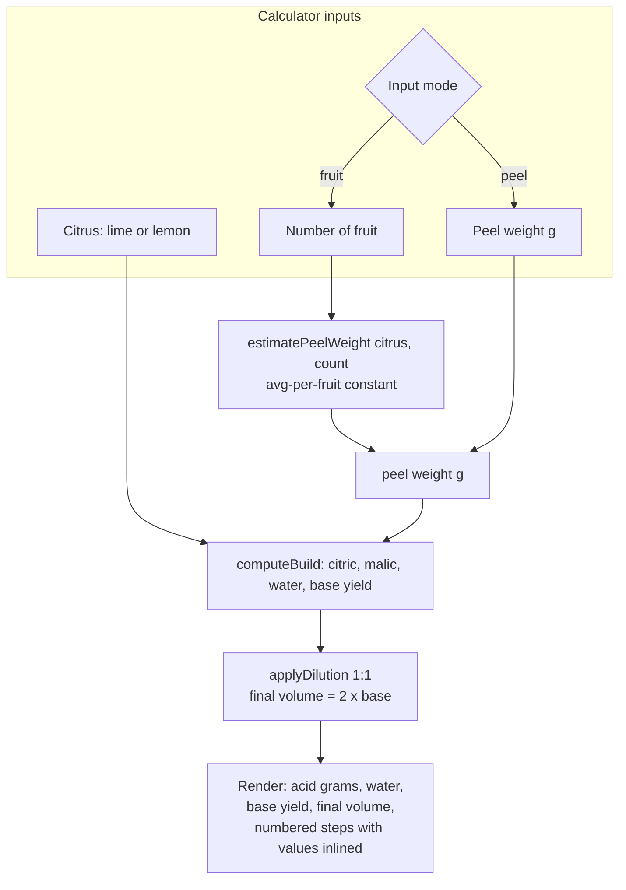

# feat: Super Juice technique page with integrated calculator

## Summary

Add a **Super Juice** technique to `/learn`: a prose section crediting Kevin Kos and explaining our 1:1 dilution modification, plus a dependency-free interactive calculator whose computed quantities are woven into the numbered method. Lime and lemon at launch. The calculator is a vanilla-JS `<script>` island over a tested pure-math module — no MDX, no frontend framework.

## Problem Frame

Super juice (acid-adjusted citrus stretched with water for ~8× yield) is a technique worth documenting, but Kevin Kos's reference keeps the proportions calculator and the method instructions on separate surfaces, and the undiluted result is more concentrated than we like for easy mixing. We want one page that (a) teaches the method with clear source attribution, (b) bakes in our standing modification — diluting the finished super juice 1:1 with water, which softens the concentration to taste and doubles the yield for batching — and (c) computes the exact quantities inline with the steps so there's no cross-referencing a separate widget. Origin: GitHub issue #63.

---

## Requirements

### Content and attribution

- R1. A Super Juice technique is reachable from `/learn` and appears in the `/learn` index alongside the existing sections.
- R2. Kevin Kos is credited on the page with links to both source pages (the method/proportions post and his calculator).
- R3. The page documents our modification — diluting the finished super juice 1:1 with water (doubling volume) — and explains the rationale (softens the concentration to taste and doubles the yield for batching).
- R4. Lime and lemon proportions match the source: lime = 0.66× citric + 0.33× malic + 16.66× water (× peel weight); lemon = 1.0× citric + 16.66× water (no malic).

### Calculator behavior

- R5. The calculator accepts a citrus selection (lime or lemon) and a starting quantity, drivable either by peel weight in grams (canonical) or by number of fruit (a clearly-labeled estimate derived from an average peel-weight constant).
- R6. The calculator outputs grams of citric acid, grams of malic acid (lime only), water quantity, the expected base yield, and the post-dilution final volume.
- R7. The numbered method renders with the computed quantities interpolated into the steps and updates live as inputs change — not a separate widget sitting above static instructions.
- R8. The page is useful without JavaScript: the proportions and method are legible from server-rendered content even if the script never runs.

### Platform and integration

- R9. No new frontend framework or heavy build dependency is introduced; interactivity uses the repo's existing `<script>`-island pattern.
- R10. The new page is indexed by Pagefind (carries `data-pagefind-body`) and passes `astro check`, `npm run validate`, and the production build.

---

## Key Technical Decisions

- KTD1. Dedicated `.astro` route + vanilla `<script>` island, not MDX. MDX's `{expression}` interpolation is build-time/server-rendered, so it does not provide the live reactivity R7 needs — that requires client JS owning the DOM nodes in either approach. The repo already does interactivity this way (`src/components/Search.astro`, `src/layouts/BaseLayout.astro`), so this matches the established pattern with zero new dependencies and an identical visual result.
- KTD2. Pure calculation logic lives in a testable module (`src/lib/superJuice.ts`); the component imports it. The math is the feature-bearing logic and the repo mandates TDD, so it is unit-tested with Vitest independent of any DOM. The island stays thin DOM wiring over tested functions.
- KTD3. Prose and attribution live in `sections/super-juice.md` (the `sections` collection) so the `/learn` index card is generated automatically like its siblings; the live numbered steps live in the component, because reactive numbers need JS-owned DOM and cannot come from static markdown.
- KTD4. The `super-juice` slug is explicitly excluded from `src/pages/learn/[slug].astro`'s `getStaticPaths`, so the dedicated `src/pages/learn/super-juice.astro` is the sole emitter of `/learn/super-juice/`. This is deterministic and does not rely on Astro's static-over-dynamic route-priority dedup to avoid a duplicate-route build failure.
- KTD5. Inputs are peel weight (canonical, exactly how Kos's method works) plus a convenience "number of fruit" input that estimates peel weight via an average-per-fruit constant, labeled as an estimate. The "desired yield" back-solve is out of scope to keep calculator logic bounded.
- KTD6. The 1:1 dilution is surfaced as a distinct, explicit output ("base yield ≈ X ml → add X ml water → ≈ 2X ml ready to use"), never silently folded into the base numbers, so the modification stays visible and teachable (R3).

---

## High-Level Technical Design

Data flow from inputs to rendered, interpolated steps. Directional guidance, not implementation specification.

Route resolution: `src/pages/learn/super-juice.astro` (static) owns `/learn/super-juice/`; `src/pages/learn/[slug].astro` (dynamic) emits every other section but filters out `super-juice` so the two never collide. `src/pages/learn/index.astro` is unchanged and lists all sections from the collection, so the index card appears automatically.

---

## Implementation Units

### U1. Super-juice calculation module + tests

- Goal: Pure, DOM-free functions that compute the full build from inputs, including peel-weight estimation and the 1:1 dilution.
- Requirements: R4, R5, R6, R3 (dilution math).
- Dependencies: none.
- Files:
  - `src/lib/superJuice.ts` (create)
  - `src/lib/superJuice.test.ts` (create)
- Approach: Export the proportion constants per citrus (lime: citric 0.66, malic 0.33, water 16.66; lemon: citric 1.0, malic 0, water 16.66) as data, plus functions: `computeBuild(citrus, peelWeightGrams)` returning `{ citric, malic, water, baseYield }`; `estimatePeelWeight(citrus, fruitCount)` using a per-citrus average constant; `applyDilution(baseYield)` returning `{ dilutionWater, finalVolume }`. Decide and document units/rounding in one place: acids to 1 decimal gram, water/volumes to whole milliliters; treat 1 g water ≈ 1 ml for yield. Define `baseYield` as the water term (16.66 × peel weight), treating the squeezed-juice addition as roughly offset by straining loss — this matches the owner's measured experience: peels from 2 lemons or 3 limes → ≈ 2 cups (≈ 473 ml) base, ≈ 4 cups (≈ 946 ml) after the 1:1 cut. Calibrate the average-per-fruit peel constants to that anchor (lemon ≈ 14 g, lime ≈ 9.5 g, so 2 lemons ≈ 3 limes ≈ ~28 g peel) and centralize them as named, retunable constants, surfaced in the UI as estimates (peel size varies by fruit). Guard invalid input (empty, non-numeric, negative) by returning a zeroed/empty result rather than NaN.
- Execution note: Implement test-first — the proportion math is the load-bearing correctness surface.
- Patterns to follow: existing testable-logic-in-`src/lib` style; Vitest conventions from `src/scripts/headerProgress.test.ts` and the `scripts/*.test.mjs` suite.
- Test scenarios:
  - Covers R4. `computeBuild('lime', 100)` → citric 66, malic 33, water 1666 (assert exact, with documented rounding).
  - Covers R4. `computeBuild('lemon', 100)` → citric 100, malic 0 (or omitted), water 1666.
  - `baseYield` equals the water term: `computeBuild('lime', 100).baseYield` → 1666 ml.
  - Calibration anchor: `estimatePeelWeight('lemon', 2)` ≈ `estimatePeelWeight('lime', 3)` ≈ 28 g (±1 g).
  - Calibration anchor: `computeBuild('lemon', 28).baseYield` ≈ 473 ml (≈ 2 cups), and `applyDilution(...).finalVolume` ≈ 946 ml (≈ 4 cups).
  - Proportionality: `computeBuild('lime', 50)` halves every output of the 100 g case.
  - Rounding: a peel weight producing fractional grams rounds per the documented rule (e.g., acids to 1 decimal, water to whole ml).
  - `estimatePeelWeight('lime', 4)` → 4 × the lime constant; `('lemon', 0)` → 0.
  - Covers R3. `applyDilution(baseYield)` returns `dilutionWater === baseYield` and `finalVolume === 2 × baseYield`.
  - Edge: empty string / `NaN` / negative peel weight → zeroed result, no `NaN` in any field.
  - Edge: very large peel weight (e.g., 10000 g) stays finite and correctly scaled.
  - Invalid citrus value → guarded (throws or returns empty), documented either way.
- Verification: `npm test` shows the new suite passing; every output field is asserted for both citrus types and the dilution path.

### U2. SuperJuiceCalculator island component

- Goal: An interactive component that renders inputs and the numbered method with live-computed values, degrading gracefully without JS.
- Requirements: R5, R6, R7, R8, R9.
- Dependencies: U1.
- Files:
  - `src/components/SuperJuiceCalculator.astro` (create)
- Approach: Markup for a citrus toggle (lime/lemon), an input-mode toggle (peel weight / number of fruit), and a labeled number input. A plain (non-`is:inline`) `<script>` — mirroring `src/layouts/BaseLayout.astro`, which already bundles an `import` from `src/scripts/` — imports the functions from `src/lib/superJuice.ts`, reads inputs, recomputes on `input`/`change`, and writes results into output nodes and into the inlined step text. (Note: `src/components/Search.astro`'s script is `is:inline`, which does NOT bundle ES imports, so it is the wrong model for the import path — reuse it only for `<style>` tokens and fallback messaging.) Server-render a static default state for R8: the canonical proportions (e.g., "per 100 g peel") and the full numbered method with placeholder/base values present in the HTML, so the page teaches the method even if the script never hydrates; the script enhances and live-updates rather than constructing the content from scratch. Malic-acid output is hidden/omitted when lemon is selected. Use accessible labels and `aria` wiring for the toggles and live regions. Scope styles with the component `<style>` block; reuse design tokens (`--color-*`, `--font-*`).
- Patterns to follow: `src/layouts/BaseLayout.astro` (plain bundled `<script>` importing a module from `src/`); `src/components/Search.astro` (`<style>` token usage and graceful fallback messaging — but its script is `is:inline` and cannot import modules).
- Test scenarios: Test expectation: none — presentational component and DOM wiring; all calculation correctness is covered by U1's module tests. Verified manually in the running app and by the build.
- Verification: In `npm run dev`, switching citrus and editing either input updates acid grams, water, base yield, final diluted volume, and the step text live; with JS disabled the proportions and method remain readable; lemon hides malic acid.

### U3. Super Juice section content

- Goal: The prose, attribution, and dilution rationale, authored as a `sections` entry so it joins the `/learn` index.
- Requirements: R1 (index presence), R2, R3, R4 (documented proportions in prose).
- Dependencies: none.
- Files:
  - `sections/super-juice.md` (create)
- Approach: Frontmatter `{ title: "Super Juice", order, summary }` — choose an `order` that slots it sensibly among existing sections (Techniques 2, Tools 3, Glossary 4; pick an unused/adjacent value). Body carries: what super juice is and why (~8× yield), explicit Kevin Kos credit with both source links, the canonical lime/lemon proportions stated in prose, our 1:1 dilution modification and its rationale, and a storage/use note: it batches well for parties (peels from 2 lemons or 3 limes make ≈ 2 cups, ≈ 4 cups after the 1:1 cut), keeps about a week or two refrigerated (Kos says use within a week; our experience is a week or two), and freezes well in ice-cube trays for later mixing. Do NOT author the live numbered steps here — those live in the component (KTD3). Keep origin claims to what the source states; follow the repo's conservative-attribution convention.
- Patterns to follow: `sections/techniques.md`, `sections/tools.md` (frontmatter shape, prose voice).
- Test scenarios: Test expectation: none — content with schema-validated frontmatter; `astro check` enforces the `sections` schema.
- Verification: `/learn` lists a "Super Juice" card; `astro check` passes; both Kos links resolve.

### U4. Dedicated route + dynamic-route exclusion

- Goal: Serve `/learn/super-juice/` from a custom page that renders the section prose and mounts the calculator, without colliding with the dynamic section route.
- Requirements: R1, R7, R8, R10.
- Dependencies: U2, U3.
- Files:
  - `src/pages/learn/super-juice.astro` (create)
  - `src/pages/learn/[slug].astro` (modify)
- Approach: New page loads the `super-juice` section entry, renders its markdown `<Content />` for the prose, and mounts `<SuperJuiceCalculator />` in the appropriate spot (prose intro → calculator → any closing notes). Reuse the `BaseLayout`, the `← Learn` back-link, the `.prose` wrapper, and `data-pagefind-body` exactly as `[slug].astro` does (mirror its prose `<style>`, or factor the shared prose styles out if that proves cleaner — mirroring is acceptable to stay in scope). In `[slug].astro`, filter `getStaticPaths` to exclude `section.id === 'super-juice'` so it no longer emits that path (KTD4).
- Patterns to follow: `src/pages/learn/[slug].astro` (content render, back-link, prose styling, Pagefind body attribute).
- Test scenarios: Test expectation: none — routing/composition; correctness is observable through the build and manual verification.
- Verification: `npm run build` completes with no duplicate-route error; `/learn/super-juice/` renders prose + calculator; Pagefind reports the page indexed; `/learn/techniques/` and the other sections still build and render.

---

## Scope Boundaries

### Deferred to Follow-Up Work

- Orange super juice (citric + malic, like lime) — lime and lemon are the ones actually used; add later if wanted.
- "Desired final yield" input that back-solves peel weight from a target volume.
- Linking recipes to the technique (e.g., a "uses super juice" pointer from recipe frontmatter or body) — separate change to the recipe pipeline.
- Extracting shared `.prose` styles into a common stylesheet if the mirror-vs-extract duplication in U4 becomes a maintenance smell.

### Out of scope

- Any new frontend framework (React/Vue/Svelte/Preact) or MDX integration.
- Cloning or embedding Kevin Kos's calculator UI; we link to it as a source only.

---

## Open Questions

- Average peel-weight-per-fruit constants are calibrated to the owner's measured anchor (2 lemons or 3 limes of peel → ≈ 2 cups base): lemon ≈ 14 g, lime ≈ 9.5 g. They stay labeled estimates in the UI since peel size varies by fruit; retune if real batches drift. (No longer blocking — resolved.)
- Re-verify the exact ratios (0.66 / 0.33 / 1.0 / 16.66) and the ~8× yield claim against the Kos source before shipping, per the issue's acceptance note. Values captured 2026-05-31 are treated as provisional until reconfirmed.

---

## Risks & Dependencies

- Route collision: if the `super-juice` exclusion in `[slug].astro` is missed, the build fails on a duplicate route. Mitigated by KTD4 and the U4 build verification — this surfaces loudly at build time, not silently in production.
- No-JS / hydration failure: a script-only calculator would leave a blank or broken page. Mitigated by R8 — the proportions and method are server-rendered and legible without the script; the island only enhances.
- External source accuracy/drift: the proportions originate from a third-party post and could be mis-captured or change. Mitigated by the Open-Questions re-verification step and by citing the source on-page.
- `astro check` over component scripts: keeping calculation logic in the type-checked `src/lib/superJuice.ts` (U1) rather than inline in the component script keeps the correctness surface under both `astro check` and Vitest.
- No external/service dependencies; no new npm packages; built on Astro 6 and existing patterns.

---

## Sources & Research

- Method and proportions (capture verified via fetch 2026-05-31): https://www.kevinkos.com/post/how-to-get-8x-as-much-juice-from-one-citrus — lime 0.66 citric / 0.33 malic / 16.66 water; lemon 1.0 citric / 16.66 water (× peel weight); steep peels with acid up to 2h, blend with water + the squeezed juice ~30s, strain, refrigerate, use within a week; ~8× yield.
- Kos calculator (reference/attribution only, not to clone): https://www.kevinkos.com/super-juice-calculator-1
- Repo island pattern: `src/components/Search.astro` (`<script>` island, token-scoped `<style>`, graceful fallback).
- Learn rendering + route shape: `src/pages/learn/[slug].astro`, `src/pages/learn/index.astro`, `sections/techniques.md`.
- Testing conventions: `src/scripts/headerProgress.test.ts`, `scripts/*.test.mjs` (Vitest via `npm test`).
- Origin: GitHub issue #63.
