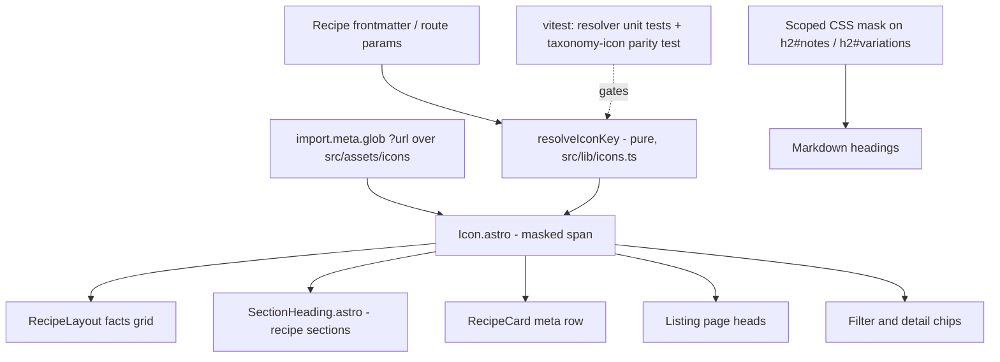

# feat: Integrate taxonomy icons across recipe pages, cards, and listings

## Summary

Surface the 75 vectorized taxonomy icons (PR #68) across the site: recipe detail facts and section headings, recipe card meta rows, listing page heads, and filter chips. One reusable `Icon` component backed by a pure, tested slug→icon resolver; icons render as CSS-masked static assets tinted by `currentColor`.

## Problem Frame

The site is text-only today. PR #68 merged tintable SVGs at `src/assets/icons/<group>/<slug>.svg` covering 9 taxonomy groups, but nothing consumes them. Two groups (categories, occasions) have no icons yet, and `by-tag` values are free-form — every surface must tolerate a missing icon without visual breakage.

---

## Requirements

**Component and resolver**

- R1. A reusable `Icon` component renders any taxonomy icon by field name + slug, tinted via `currentColor` and sized via CSS (the SVGs carry only a viewBox).
- R2. A pure resolver maps the field names call sites already use (`glass`, `method`, `ice`, `difficulty`, `format`, `spirit`/`spirits`, `family`/`families`, `flavor`/`flavors`, plus `sections`) to icon paths, returning a miss for unknown groups or slugs. Key set mirrors `LABEL_MAPS` in `src/lib/taxonomy.ts`.
- R3. A missing icon degrades silently in the UI: text label renders unchanged, no placeholder, no broken layout.
- R4. A vitest parity test asserts every slug in an icon-bearing taxonomy group has a matching SVG, with an explicit allowlist for known-missing groups (categories, occasions). New unmapped slugs fail CI; expected gaps stay quiet.

**Surfaces**

- R5. Recipe detail facts grid (Family / Glass / Method / Ice / Difficulty) shows an icon per value, including each value in a multi-family row and the `ice: none` glyph.
- R6. Recipe section headings carry icons: component-rendered (Ingredients, Steps, House-Made, Batch), markdown-rendered (`## Notes`, `## Variations`), and the Related aside. Garnish and Float inline lines get their icons. Attribution is excluded — no icon asset exists.
- R7. Recipe card meta row shows icons for method, difficulty, and format; the format value renders through `label()` (fixes the raw-slug bug at `src/components/RecipeCard.astro:32`).
- R8. Listing page heads (`by-spirit`, `by-flavor`, `by-family`, `by-difficulty`) show the value's icon beside the h1; `by-occasion` and `by-tag` take the text-only path. `by-style` (legacy redirect) is untouched.
- R9. Filter chips on the index and the spirit/flavor chip lists on recipe detail pages show icons.

**Performance and accessibility**

- R10. Repeated icons add no per-occurrence HTML weight — each unique icon is fetched once as a cached static asset, not inlined per use.
- R11. Icons are decorative: `aria-hidden` (already baked into the SVGs) and text labels always remain visible.

---

## Key Technical Decisions

- **CSS `mask-image` rendering, not inline SVG.** The `Icon` component emits an empty `aria-hidden` span styled `background-color: currentColor; mask: url(<asset>) center / contain no-repeat`. Rationale: potrace output is heavy (`flavors/botanical.svg` 9.8KB, `methods/blended.svg` 8.4KB); inlining on grid pages would add hundreds of KB of repeated path data to one HTML file, and a per-page `<symbol>`/`<use>` sprite is awkward to assemble across Astro component boundaries. Masked URL assets are deduped by the browser cache site-wide, tint via `currentColor` exactly like inline SVG, and the same CSS mechanism extends to markdown-rendered headings where no component can be injected. Trade-off accepted: single-color rendering (icons are already monochrome) and icons may drop out of print stylesheets (decorative, acceptable).
- **Resolver mirrors `label()`.** Same field-name key set as `LABEL_MAPS` (`src/lib/taxonomy.ts:29-50`), aliasing to icon dir names (`glass`→`glassware`, `ice`→`ice`, `difficulty`→`difficulty`, `format`→`format`, `method`→`methods`, singular/plural pairs for spirits/families/flavors). The taxonomy.yaml plural keys (`glasses`, `ices`, …) are not the call-site vocabulary; aliasing the field-name layer prevents valid icons silently hitting the fallback.
- **Pure logic split from asset loading.** `import.meta.glob('../assets/icons/**/*.svg', { query: '?url', eager: true })` lives in the Astro/component layer; the testable resolver (`resolveIconKey(field, slug)` → `"glassware/coupe"` or miss) takes the available-key set as input. Mirrors how `taxonomy.test.ts` tests `groupByTax` with stubbed data, per the repo's dependency-injection convention.
- **Parity test over build-time warnings.** Occasions (7), categories (4), and all by-tag values are known-missing; a `console.warn` firing every build is noise that trains people to ignore it. A vitest test with an explicit allowlist matches the repo's existing hard-gate culture (codegen-staleness CI check) and only fails on genuinely new gaps. (Learning carried from `docs/solutions/design-patterns/body-to-frontmatter-migration-pattern.md`: fail loud on unknown shapes, but deliberately.)
- **Attribution heading excluded.** No `sections/attribution.svg` exists. Excluding it keeps the happy path warning-free; commission the icon alongside the categories/occasions grids later.

---

## High-Level Technical Design

Markdown headings are the one surface the component can't reach (rendered by `<Content />`); they reuse the identical mask CSS keyed on Astro's auto-generated heading ids.

---

## Implementation Units

### U1. Icon resolver and Icon component

- **Goal:** Pure slug→icon-key resolver plus the `Icon.astro` masked-span component every surface consumes.
- **Requirements:** R1, R2, R3, R4, R10, R11
- **Dependencies:** none
- **Files:** `src/lib/icons.ts`, `src/lib/icons.test.ts`, `src/components/Icon.astro`
- **Approach:** Resolver exports the field→dir alias map and `resolveIconKey(field, slug, availableKeys)`; miss returns null. `Icon.astro` builds the available-key set from the eager `?url` glob, calls the resolver, and renders nothing on miss. Base sizing (`width/height: 1em`, `display: inline-block`, vertical alignment) lives in the component; call sites override size via class or custom property. Parity test reads slug arrays from `src/taxonomy.generated.ts` and the icon tree from disk, with the categories/occasions allowlist.
- **Execution note:** Resolver and parity test are test-first per repo TDD mandate.
- **Patterns to follow:** `label()` and `LABEL_MAPS` in `src/lib/taxonomy.ts`; test style of `src/lib/taxonomy.test.ts`.
- **Test scenarios:**
  - Each call-site field name (`glass`, `method`, `ice`, `difficulty`, `format`, `spirit`, `spirits`, `family`, `families`, `flavor`, `flavors`, `sections`) resolves a known slug to the correct `dir/slug` key.
  - Unknown field (`category`, `occasion`, `tag`) returns the miss value.
  - Known field with unlisted slug (e.g., a future spirit with no SVG) returns the miss value.
  - Parity: every slug in spirits, glasses, flavors, families, methods, ices, difficulties, formats has a matching SVG file; categories and occasions are allowlisted; an unexpected gap fails with a message naming the slug.
- **Verification:** `npm test` green; rendering an `Icon` for a missing slug produces no DOM output.

### U2. Recipe detail facts grid

- **Goal:** Icon per value in the facts `<dl>` (Family / Glass / Method / Ice / Difficulty).
- **Requirements:** R5
- **Dependencies:** U1
- **Files:** `src/layouts/RecipeLayout.astro`
- **Approach:** Icon ahead of each `<dd>` value, including one per family link in multi-family rows; `ice: none` renders its slash glyph. Scoped `.facts` styles own the size/gap.
- **Test scenarios:** Test expectation: none — pure styling/layout on an existing data path; resolver behavior covered by U1.
- **Verification:** A recipe with multiple families, `ice: none`, and all five facts renders an icon per value with no layout shift at mobile width.

### U3. Section headings, garnish/float lines, markdown headings

- **Goal:** Iconified headings across all three rendering mechanisms with one visual treatment.
- **Requirements:** R6
- **Dependencies:** U1
- **Files:** `src/components/recipe/SectionHeading.astro` (new), `src/components/recipe/Ingredients.astro`, `src/components/recipe/Steps.astro`, `src/components/recipe/HouseMade.astro`, `src/components/recipe/BatchInstructions.astro`, `src/layouts/RecipeLayout.astro`
- **Approach:** `SectionHeading` wraps an h2 with its `sections/*` icon; the four recipe components and the Related aside adopt it. Garnish/Float `
<strong>` lines in `Ingredients.astro` get inline icons. Markdown `## Notes` / `## Variations` get the same mask CSS via `:global(h2#notes)::before` / `:global(h2#variations)::before` — size and gap matched to `SectionHeading` so the mechanisms are indistinguishable. Attribution aside keeps its plain heading.
- **Test scenarios:** Test expectation: none — styling/layout; section icon existence covered by U1 parity test.
- **Verification:** A published recipe with house-made, batch, garnish, float, notes, and variations shows a consistent icon treatment on every section; markdown and component headings are visually identical.

### U4. Recipe cards and listing page heads

- **Goal:** Card meta-row icons and listing-head icons; fix the raw format slug.
- **Requirements:** R7, R8
- **Dependencies:** U1
- **Files:** `src/components/RecipeCard.astro`, `src/pages/by-spirit/[spirit].astro`, `src/pages/by-flavor/[flavor].astro`, `src/pages/by-family/[family].astro`, `src/pages/by-difficulty/[difficulty].astro`
- **Approach:** Small icons beside method, difficulty, and format in `.recipe-card-meta`; format value routed through `label()`. Listing page heads place the value icon beside the h1, sized to the heading; `by-occasion` and `by-tag` are left as-is (resolver miss renders nothing if wired, but skipping the wire-up there is fine too — pick at implementation).
- **Test scenarios:** Test expectation: none for icon styling. The format-label fix is behavioral but trivially covered: if a `label()` regression test is cheap to add alongside existing taxonomy tests, add one asserting `label('format', 'batch')` → `Batch`; otherwise verify visually.
- **Verification:** Index grid shows iconified meta rows with no card height inconsistency; `/by-spirit/gin/` shows the gin icon in the page head; `/by-tag/<any>/` unchanged.

### U5. Filter and detail-page chips

- **Goal:** Icons in the index filter chips and the recipe detail spirit/flavor chip lists, so the two chip surfaces match.
- **Requirements:** R9
- **Dependencies:** U1
- **Files:** `src/pages/index.astro`, `src/layouts/RecipeLayout.astro`, `src/styles/global.css` (`.chip` sizing rule)
- **Approach:** Icon inside each chip before the label for spirit, difficulty, method, and flavor chips. `currentColor` picks up the `chip-active`/hover tint automatically; verify the client-side filter script's DOM assumptions (text content matching) survive the added span.
- **Test scenarios:** Test expectation: none — styling; but manually exercise the filter interaction since the chip DOM changes.
- **Verification:** Chips render icons in default, hover, and active states with correct tint; index filtering still works for every facet.

---

## Scope Boundaries

**Deferred to Follow-Up Work**

- Generating the categories (4 icons) and occasions (7 icons) grids — prompts exist in `docs/icon-set-prompts.md`; pipeline is `data/icon-grids.json` + `npm run icons`. On landing, remove them from the parity allowlist and wire `by-occasion` heads.
- `sections/attribution.svg` — commission with the grids above, then adopt `SectionHeading` in the Attribution aside.
- Icons for free-form `by-tag` values — no asset model for arbitrary strings; revisit only if tags become a taxonomy.

**Out of scope**

- `hero_image` / `gallery` recipe imagery (reserved schema fields, separate feature).
- Any redesign beyond icon insertion; layout and typography stay as-is.
- `by-style` pages (legacy redirects slated for deletion).

---

## Risks

- **Mask rendering vs. asset URL handling:** Vite emits hashed URLs for `?url` glob imports and handles the GitHub Pages base path; verify one icon end-to-end in `npm run build` output early in U1 before fanning out to surfaces.
- **Markdown heading drift:** the `h2#notes` CSS hook breaks silently if a recipe titles the section differently (`## Variation`). Acceptable — degrades to a plain heading, and the body-structure linter already constrains section headings.
- **Chip filter script coupling (U5):** if the index filter script reads chip text content, the inserted icon span could perturb it; check before styling.

---

## Sources & Research

- `src/lib/taxonomy.ts:29-50` — `label()` / `LABEL_MAPS`, the pattern the resolver mirrors.
- `src/layouts/RecipeLayout.astro:28-67` (facts grid), `:109,121` (asides); `src/components/RecipeCard.astro:25-35` (meta row, format bug at line 32).
- `scripts/prep-icons.mjs` header — icon contract: `currentColor` fill, `aria-hidden` baked, no fixed dimensions.
- Icon inventory: 75 SVGs, full coverage of 8 taxonomy groups + 9 section glyphs; categories and occasions pending (`docs/icon-set-prompts.md`).
- `docs/solutions/design-patterns/body-to-frontmatter-migration-pattern.md` — fail-loud-deliberately and DI-for-testability conventions.
