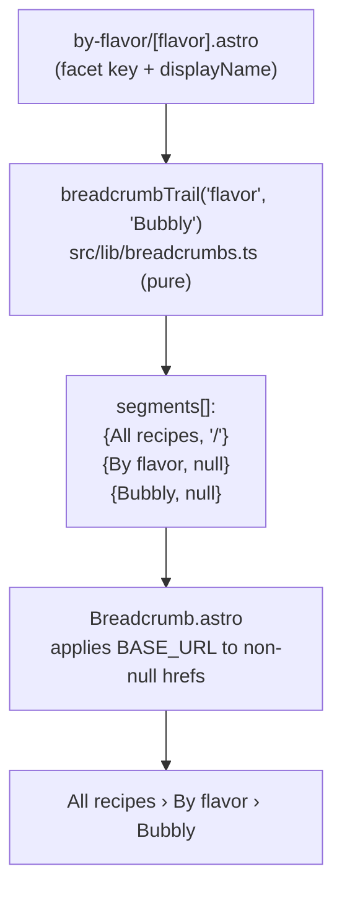

# feat: Add breadcrumb navigation to by-* taxonomy pages

## Summary

Add a breadcrumb trail (`All recipes › By flavor › Bubbly`) to the six live by-* taxonomy listing pages, replacing the lone eyebrow label above each value heading. The trail's segment logic lives in a unit-tested pure helper in `src/lib/`; a shared `Breadcrumb.astro` component renders it and applies `BASE_URL`. Closes #69.

---

## Problem Frame

The by-* listing pages (`/by-flavor/<v>/`, `/by-spirit/<v>/`, `/by-family/<v>/`, `/by-difficulty/<v>/`, `/by-occasion/<v>/`, `/by-tag/<v>/`) show only a static eyebrow label ("By flavor") above the value heading. A visitor on a value page has no in-page affordance to move up the hierarchy back to all recipes or to a facet index. Breadcrumbs give that upward path and orient the visitor in the taxonomy.

`by-style/[style].astro` is excluded — it is a legacy meta-refresh redirect to `/by-tag/`, not a live listing page.

---

## Requirements

### Breadcrumb behavior

- R1. Each of the six live by-* value pages renders a breadcrumb trail in place of the current `<p class="eyebrow">By X</p>` label.
- R2. The trail has three segments: a root (`All recipes`) linking home, a facet segment (`By flavor`), and the current value (`Bubbly`) as unlinked terminal text.
- R3. The facet segment links to a facet index only where one exists. Today only `family` has an index (`/families/`); the other five facets render the facet segment as plain unlinked text.
- R4. All breadcrumb links respect the `BASE_URL` handling used across the site (strip trailing slash, prepend to path).

### Code shape

- R5. The segment-building logic is a pure function in `src/lib/` with no Astro or `import.meta.env` dependency, unit-tested with Vitest.
- R6. An unknown facet key passed to the helper fails loudly (throws) rather than rendering a malformed trail — guards against typos when wiring pages.

---

## Key Technical Decisions

- **Pure helper + presentational component split.** The repo unit-tests only `src/lib/` and `src/scripts/` logic; `.astro` files have no render-test harness (no `experimental_AstroContainer` in the suite). So the testable decision surface — segment labels, which segment links where, terminal-unlinked rule — goes in a pure `src/lib/breadcrumbs.ts` helper. The `Breadcrumb.astro` component and CSS are presentational wiring, exempt from TDD per CLAUDE.md.
- **Helper returns base-relative paths; component applies `BASE_URL`.** Keeping `import.meta.env.BASE_URL` out of the helper preserves its purity (and testability). The helper emits paths like `/` and `/families/`; the component prepends the stripped base via the established `import.meta.env.BASE_URL.replace(/\/$/, '')` pattern.
- **Facet metadata is a single map in the helper.** Facet key → eyebrow label + optional index path lives in one place (`src/lib/breadcrumbs.ts`), so adding a future facet index (e.g., a spirits index) is a one-line edit, not a six-page hunt.
- **Recipe-detail back link unchanged.** The `← All recipes` link in `RecipeLayout.astro` stays as-is and out of scope (see Scope Boundaries). The issue raised replace-vs-complement; this plan complements (leaves it), keeping the change surface to listing pages only.

---

## High-Level Technical Design

Data + render flow for one by-* page:



Segment shape returned by the helper:

```
[
  { label: 'All recipes', href: '/' },        // root, always linked
  { label: 'By flavor',   href: null },        // facet — href set only if index exists
  { label: 'Bubbly',      href: null },        // current value — always terminal/unlinked
]
```

(Directional — final field names settled in implementation.)

---

## Implementation Units

### U1. Breadcrumb segment helper + facet metadata

- **Goal** — Pure function that maps a facet key + display name to an ordered breadcrumb segment array, plus the facet→(label, index-path) metadata map.
- **Requirements** — R2, R3, R5, R6.
- **Dependencies** — none.
- **Files** — `src/lib/breadcrumbs.ts` (create), `src/lib/breadcrumbs.test.ts` (create).
- **Approach** — Export `breadcrumbTrail(facetKey, displayName)` returning `{ label, href }[]`. Internal const map keyed on six **singular** facet keys — `flavor`, `spirit`, `family`, `difficulty`, `occasion`, `tag` — each → `{ eyebrow, index }`, e.g. `flavor → { eyebrow: 'By flavor', index: undefined }`, `family → { eyebrow: 'By family', index: '/families/' }`. Only `family` carries an index path. Root segment (`All recipes` → `/`) is constant-prepended; terminal value segment (`displayName` → `null`) is constant-appended. Unknown key throws.
  - These breadcrumb keys are a **new singular-key set, distinct from `taxonomy.label()`'s field keys** — note `by-spirit` calls `label('spirits', …)` (plural) but the breadcrumb key is `spirit`. Do not reuse the page's `label()` field string as the breadcrumb key, or R6's throw fires.
  - Eyebrow strings (`By spirit`, etc.) are **literals in this map, not derived from `label()`** — `by-tag` has no `tag` label entry, so sourcing eyebrow text from `label()` would title-case the slug instead.
- **Execution note** — Test-first: write the failing helper spec before the implementation.
- **Patterns to follow** — `src/lib/taxonomy.ts` export + label-map style; `src/lib/taxonomy.test.ts` describe/it layout.
- **Test scenarios**
  - `breadcrumbTrail('flavor', 'Bubbly')` returns three segments in order: `All recipes`/`/`, `By flavor`/`null`, `Bubbly`/`null`. (Covers R2, R3.)
  - `breadcrumbTrail('family', 'Sour')` sets the facet segment href to `/families/` (the one facet with an index). (Covers R3.)
  - Each of the other five facets (`spirit`, `difficulty`, `occasion`, `tag`, and `flavor`) returns a `null` href on the facet segment. (Covers R3.)
  - Root segment always `{ label: 'All recipes', href: '/' }` regardless of facet. (Covers R2.)
  - Terminal segment label equals the passed `displayName` verbatim and href is `null`. (Covers R2.)
  - Facet eyebrow labels match the existing page labels exactly (`By flavor`, `By spirit`, `By family`, `By difficulty`, `By occasion`, `By tag`).
  - An unknown facet key (e.g. `'style'`) throws. (Covers R6.)
- **Verification** — `npm test` passes with the new spec; helper has no `astro`/`import.meta` imports.

### U2. Breadcrumb component + styles

- **Goal** — Shared `Breadcrumb.astro` that renders a segment array as `A › B › C`, linking segments with a non-null href (base-applied) and rendering null-href segments as plain text; with `.breadcrumb` CSS.
- **Requirements** — R1, R4.
- **Dependencies** — U1.
- **Files** — `src/components/Breadcrumb.astro` (create), `src/styles/global.css` (modify — add `.breadcrumb` block near the `.eyebrow` / `.page-head` primitives).
- **Approach** — Props: `segments: { label: string; href: string | null }[]`. Markup model is the ARIA breadcrumb pattern: `<nav aria-label="Breadcrumb"><ol>` with one `<li>` per segment, so screen readers announce position/count. Strip base via `import.meta.env.BASE_URL.replace(/\/$/, '')`; a segment with href renders `<a href={base + seg.href}>`, else the label as plain text. The `›` separator is an `aria-hidden` CSS `::before` on every `<li>` except the first (keeps it out of the accessible name and out of the `<li>` count). Mark the terminal segment `aria-current="page"`.
  - **Interaction states** — breadcrumb links keep the global underline affordance; do not suppress it for the muted/small treatment (suppressing would hide the link). `:focus-visible` is already handled site-wide.
  - **Responsive** — allow wrap between segments on narrow viewports; separator stays with its segment. No ellipsis truncation — all three labels stay readable.
  - **Spacing** — set `.breadcrumb` `margin: 0` explicitly (the removed eyebrow `<p>` got zero margin from the global `p` reset; the new `<nav>` won't inherit that).
  - **`aria-current` coexistence** — `BaseLayout` already sets `aria-current="page"` on the primary "Recipes" nav tab; the breadcrumb terminal adds a second on the same page. This is valid ARIA and intentional (two distinct nav landmarks) — don't strip either.
  - Style `.breadcrumb` to read as a muted, small label consistent with the `.eyebrow` treatment (reuse font-size/letter-spacing tokens).
- **Execution note** — Presentational wiring; no unit test (no `.astro` render harness in the repo).
- **Patterns to follow** — base-strip pattern in `RecipeCard.astro` / `BaseLayout.astro`; `.eyebrow` rule in `src/styles/global.css`.
- **Test scenarios** — Test expectation: none — presentational component with no unit-test harness; behavior is covered by U1's helper tests plus the U3 build/visual check.
- **Verification** — `npm run build` (astro check) passes; component renders links only for non-null hrefs.

### U3. Wire breadcrumbs into the six by-* pages

- **Goal** — Replace the `<p class="eyebrow">By X</p>` line in each live by-* page with the `Breadcrumb` component fed by `breadcrumbTrail(<facetKey>, displayName)`.
- **Requirements** — R1, R2, R3.
- **Dependencies** — U1, U2.
- **Files** — `src/pages/by-flavor/[flavor].astro`, `src/pages/by-spirit/[spirit].astro`, `src/pages/by-family/[family].astro`, `src/pages/by-difficulty/[difficulty].astro`, `src/pages/by-occasion/[occasion].astro`, `src/pages/by-tag/[tag].astro` (modify each).
- **Approach** — In each page, import `Breadcrumb` and `breadcrumbTrail`; inside `.page-head`, swap the eyebrow `<p>` for `<Breadcrumb segments={breadcrumbTrail('<facetKey>', displayName)} />`, substituting that page's facet key — `flavor` in `by-flavor/[flavor].astro`, `spirit` in `by-spirit/[spirit].astro`, and so on for `family`, `difficulty`, `occasion`, `tag` (the singular keys from U1, **not** the `label()` field strings). Leave the `<h1>` (with or without its `Icon`) and `.lede` untouched. `by-style/[style].astro` is not touched (legacy redirect).
- **Patterns to follow** — existing `.page-head` block in each page; props already in scope (`displayName`).
- **Test scenarios** — Test expectation: none — mechanical per-page wiring; segment correctness is U1's tests, render is the build check below.
- **Verification** — `npm run build` succeeds; spot-check rendered output on one linked-facet page (`/by-family/<v>/` shows `All recipes › By family › <Value>` with the middle segment linked to `/families/`) and one unlinked-facet page (`/by-flavor/<v>/` middle segment is plain text). Confirm `npm run validate` still clean.

---

## Scope Boundaries

In scope: breadcrumb trail on the six live by-* listing pages; the shared component, helper, and CSS supporting it.

Out of scope (true non-goals):

- The recipe-detail `← All recipes` back link in `RecipeLayout.astro` — left as-is; not converted to a breadcrumb.
- `by-style/[style].astro` — legacy meta-refresh redirect, not a live listing page.

### Deferred to Follow-Up Work

- Facet index pages for the non-family facets (spirit, flavor, difficulty, occasion, tag). When one ships, the only change is adding its index path to the facet-metadata map in `src/lib/breadcrumbs.ts`; the breadcrumb then links automatically.

---

## Risks & Dependencies

- Low risk; additive presentational change on six pages plus one new tested helper and one new component. No data, schema, or build-pipeline changes.
- The `family` facet index (`/families/`) was added recently (#61). R3 depends on that route existing; it does (`src/pages/families.astro`). If `/families/` were ever removed, the family facet segment would link to a dead path — covered by the same getStaticPaths reality that governs the rest of the site.
