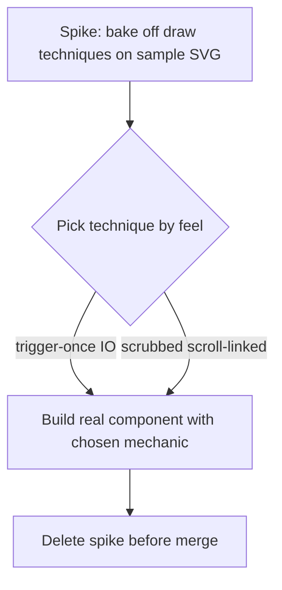
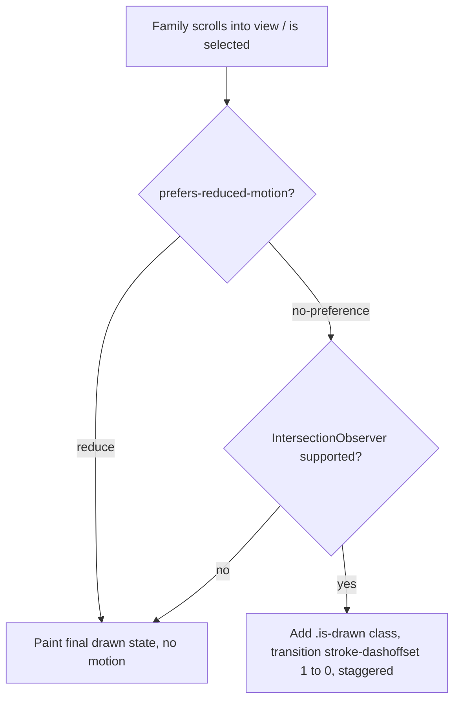

# feat: Families branching map with scroll-draw

## Summary

Replace the `/families` card grid with a *Cocktail Codex*–style per-family branching map: a root family node with its member recipes branching out via SVG connectors that draw in when the family scrolls into view, plus a tab control to hop between the six families. Front-load a throwaway spike phase to workshop the draw-on-scroll feel, then build the real component once the technique is chosen. Built from existing `families[]` / `related[]` content — no schema change.

---

## Problem Frame

`src/pages/families.astro` is today a flat grid of six cards, structurally identical to every other browse page. It states that six root families exist but shows nothing about how recipes relate to them. Issue #10 asks for distinctiveness tied to cocktails specifically; the *Cocktail Codex* framework the page already cites is inherently visual (root + radiating variations), and rendering it as cards throws away the one genuinely ownable visual concept the site has.

The brainstorm (see origin) resolved the shape — per-family branching, drawn on scroll-into-view, nav to hop between roots — and ruled out a multi-generation genealogy (not in the data, and the book itself is not a lineage). The user added one execution constraint on top: workshop the scroll-draw effect in disposable spikes before wiring it into the page, because the *feel* of the animation is the risky, taste-driven part.

---

## Key Technical Decisions

- **Throwaway spike bake-off before committing the technique.** A disposable, unrouted spike page bakes off the draw mechanics on sample geometry so the feel is settled before any page code. The spike is deleted before merge; its learnings fold into the real component. This is the user's explicit ask and the highest-uncertainty part of the work.

- **Draw mechanism: `pathLength="1"` + `stroke-dashoffset`, IntersectionObserver trigger-once.** Connectors are real strokes (`fill:none`) with `pathLength="1"`, so every path normalizes to a 0–1 dash range with no `getTotalLength()` measurement. An IntersectionObserver adds a class once on enter; CSS transitions `stroke-dashoffset` with per-path `transition-delay` for a branch-grows-outward effect. CSS `animation-timeline: view()` is only ~82% supported (Firefox still flagged in 2026), so it is at most progressive enhancement — the JS path is primary. (intent: implementation-guidance; see Sources.)

- **Default state is fully drawn; JS hides-then-reveals.** The no-JS / unsupported / observer-never-fires state renders the complete map. JS sets the undrawn state on init and releases it on enter. Guarantees content and links are always reachable.

- **Hand-authored inline `<svg>`, not `Icon.astro`.** `Icon.astro` paints via CSS `mask` and cannot expose stroke geometry, so the connectors and node frame are authored as inline `<svg><path>` in a new component. Family glyphs still nest inside each node via `Icon.astro`.

- **Pure-function test seam, mirroring `src/scripts/headerProgress.ts`.** Vitest runs in node env with no DOM harness, so the family-map data model, node-layout geometry, and the should-animate decision are extracted as pure functions and unit-tested; the `.astro` `<script>` DOM wiring (observer, class toggles) stays untested, consistent with the repo.

- **Per-family render + segmented-tab switcher.** All six families render to the DOM; a tab control shows one at a time and re-runs the draw on switch. No URL/hash reflection in v1.

- **Data from `families[]` / `related[]` via `groupByTax`; no schema change.** Members come from `groupByTax(recipes,'families')`. A member may sub-branch one level to its `related[]` entries that also belong to the family in view. Bridge recipes (two families) appear as members in each. The empty Flip family renders as a labeled root with the existing `is-empty` treatment.

- **Accessibility baked in, not bolted on.** `<svg role="img">` with `<title>`/`<desc>` plus an adjacent text/list equivalent; member nodes are real `<a>` elements with `:focus-visible`; `prefers-reduced-motion` paints the final state instantly in both CSS and JS.

---

## High-Level Technical Design

Build flow — the spike gates the component:

Per-family render + draw-state decision (runs per family map, in CSS and mirrored in JS):

Data → view: `publishedRecipes()` → `groupByTax(…,'families')` → **family-map model** (pure: root + branch nodes + one level of `related[]` sub-branches, each resolved to `{title, url}`) → **layout geometry** (pure: node coords + cubic connector `d` strings + viewBox) → inline `<svg>` in `FamilyMap.astro`.

---

## Requirements Traceability

All origin requirements (R1–R15) are carried. Mapping to units:

- Structure/data (R1–R5): U2 (model), U3 (render).
- Layout/visual language (R6–R8): U3 (component + tokens), U2 (geometry).
- Motion/interaction (R9–R11): U1 (spike), U4 (draw behavior), U5 (switch redraw).
- Accessibility/responsive (R12–R14): U4 (reduced-motion), U6 (a11y + responsive + text equivalent).
- Empty-state (R15): U2 (model returns no branches), U3 (`is-empty` render).

Acceptance Example coverage (origin AEs → unit):

- AE1 (switch redraws): U5.
- AE2 (reduced-motion static): U4.
- AE3 (bridge recipe in both families): U2.
- AE4 (related sub-branch): U2.
- AE5 (empty Flip bare root): U2 + U3.
- AE6 (mobile reflow): U6.

---

## Implementation Units

### Phase 1 — Spike (throwaway)

### U1. Scroll-draw technique bake-off

- **Goal:** Settle how the draw-on-scroll feels before any page work. Prototype the mechanic on a hand-authored sample SVG (~1 root + 5 branch nodes with cubic connectors).
- **Requirements:** R9, R11 (validates the motion approach).
- **Dependencies:** none.
- **Files:** `src/pages/_spike-draw.astro` (underscore-prefixed → excluded from routing by Astro; throwaway).
- **Approach:** Author one sample SVG, connectors `fill:none` with `pathLength="1"`. Implement two togglable variants in the page: (a) IntersectionObserver trigger-once adds `.is-drawn`, CSS transitions `stroke-dashoffset` 1→0 with per-path `transition-delay`; (b) CSS `animation-timeline: view()` scrubbed variant behind `@supports`. Include a `prefers-reduced-motion` check that paints the final state. Compare feel (speed, stagger, scrubbed vs once); record the decision in the PR description.
- **Execution note:** Disposable exploratory spike — not test-driven. Must be deleted before the PR merges; its outcome is a recorded technique decision, not shipped code.
- **Patterns to follow:** scroll/reduced-motion wiring from `src/layouts/BaseLayout.astro` (`matchMedia`, `requestAnimationFrame`, passive listener); entrance-stagger idiom (`--i`) from `src/styles/learn-feature.css` `.reveal`.
- **Test scenarios:** Test expectation: none — throwaway spike, no shipped behavior (per CLAUDE.md styling/spike exemption).
- **Verification:** Both variants visibly draw connectors on enter; reduced-motion shows the static final map. The chosen technique is recorded in the PR description **with concrete values** — draw duration, easing, and per-branch stagger increment — so U4 implements named numbers rather than re-discovering feel. Spike file removed before merge.

### Phase 2 — Build

### U2. Family-map model + layout geometry (pure, tested)

- **Goal:** Two pure functions: (1) build the per-family node model from recipe data; (2) compute SVG node coordinates, connector path `d` strings, and viewBox from that model.
- **Requirements:** R1, R2, R3, R4, R7, R15.
- **Dependencies:** none.
- **Files:** `src/lib/familyMap.ts`, `src/lib/familyMap.test.ts`. (`familyMap.ts` also houses the `shouldAnimate` predicate used by U4 — see that unit.)
- **Approach:** Model fn takes `(recipes, familySlug, base)` and returns `{ root: {slug,label}, branches: [{title, url, subBranches: [{title, url}]}] }`. Members via `groupByTax(recipes,'families')`. **Slug is the join key everywhere**: derive `slug = id.split('/').pop()` for every member, build a `Set<slug>`, and resolve URL as `${base}/recipes/${slug}/` (matching `RecipeCard.astro` — do **not** use the unused `recipeUrl` helper, which takes the full `id` and yields a broken `/recipes/classics/foo.md/`). Sub-branches = a member's `related[]` slugs present in that member `Set`, one level only, de-duplicated so a recipe isn't both a top branch and a sub-branch; `related[]` slugs not in the set (cross-family) are ignored.
- **Layout decision (resolves the deferred algorithm):** v1 uses a **deterministic vertical-branching fan** — root at top, branches distributed down a fixed-width canvas, sub-branches offset off their parent — emitting cubic "elbow" connector `d` strings, all carrying `pathLength="1"`. The fan is chosen over radial because it is trivially snapshot-testable and reflows to narrow viewports by viewBox scaling alone (no separate mobile coordinate set). Radial is a deferred refinement, not v1. No randomness, so output is stable.
- **Test fixtures:** scenarios build minimal `Recipe`-shaped literals via a small `makeRecipe({ id, families, related })` helper cast to `Recipe`; the model fn depends only on `{ id, data.families, data.related }` so fixtures stay light and pass `astro check`.
- **Execution note:** Implement test-first — this is the feature-bearing logic core.
- **Patterns to follow:** pure-fn + co-located `.test.ts` discipline of `src/scripts/headerProgress.ts`, `src/lib/taxonomy.ts`; data access in `src/lib/recipes.ts`, `src/lib/taxonomy.ts`.
- **Test scenarios:**
  - Happy: a family with N members returns N branch nodes; geometry produces N non-overlapping coordinates within the viewBox.
  - Covers AE5. Empty family (Flip, 0 members) → model has root and empty `branches`; geometry produces a root-only layout with no connectors.
  - Edge: 1 member; large N (8) still fits the viewBox without overlap (R7).
  - Covers AE3. A bridge recipe (`families: [daiquiri, whiskey-highball]`) appears as a branch when the model is built for *either* family.
  - Covers AE4. A member whose `related[]` includes another same-family member yields that recipe as a sub-branch off it, and the related recipe is not also rendered as a duplicate top-level branch.
  - Edge: a `related[]` slug that is not a member of the family in view is ignored (no cross-family sub-branch).
  - URL/slug derivation correct for a nested `id` like `classics/manhattan.md`.
- **Verification:** `npm test` green; geometry output stable across runs.

### U3. FamilyMap component (static, fully-drawn)

- **Goal:** Render one family's map as inline SVG in its complete (drawn) state, styled with existing tokens.
- **Requirements:** R5, R6, R7, R8, R15.
- **Dependencies:** U2.
- **Files:** `src/components/FamilyMap.astro`.
- **Approach:** Take a `familySlug` (and the recipe list) prop; call U2 to get model + geometry; render inline `<svg>` with connector `<path>`s (default `stroke-dashoffset:0` = fully drawn), node frames, and `Icon.astro` family glyph + label in the root node. Member nodes are `<a href>` to the recipe; the root node links to `/by-family/<slug>/` when the family is non-empty, inert for empty Flip. Scoped `<style>` using `@theme` tokens (`--color-accent`, `--color-surface`, `--color-rule-strong`, fonts).
- **Node states:** member nodes get hover + `:focus-visible` treatment (node stroke brightens to `--color-accent`, label underlines) so mouse and keyboard parity holds — SVG `<a>` does not inherit the site's card hover styles, so this is explicit.
- **Sub-branch subordination (R2):** top-level and sub-branch connectors are visually distinct — define **two** `<marker>` arrowheads in `<defs>` (`#arrow` primary, `#arrow-sub` smaller) and give sub-branch paths a lighter `stroke-opacity` / thinner weight. One shared marker would flatten the hierarchy R2 requires.
- **Empty Flip (R15, AE5):** the map canvas shows the bare labeled root plus in-SVG text ("No recipes yet in this family"), de-emphasised — not a lone dimmed node in an empty canvas (the grid-era `is-empty` opacity treatment doesn't translate to the single-family view).
- **Reuse (R8):** build only what `FamilyMap.astro` needs; keep the node/branch primitives clean, but treat reusability as a deferred outcome, not a v1 design constraint — no second consumer exists yet.
- **Patterns to follow:** scoped `<style>` + token usage in `src/pages/families.astro`, `src/components/RecipeCard.astro`; `Icon.astro` nesting; `base` trailing-slash idiom.
- **Test scenarios:** Test expectation: none for markup/styling (TDD-exempt); the data correctness behind it is covered by U2. `astro check` must pass (typed props).
- **Verification:** Each non-empty family renders root + branches with arrowheads; links resolve; Flip renders a bare labeled root with no dead links; palette matches the site.

### U4. Draw-on-scroll behavior

- **Goal:** Wire the chosen spike technique so a family's connectors draw in on scroll-into-view, with full degradation.
- **Requirements:** R9, R11, R12, R14.
- **Dependencies:** U1 (technique), U3.
- **Files:** `src/components/FamilyMap.astro` (`<script>` wiring), `src/lib/familyMap.ts` + `src/lib/familyMap.test.ts` (the `shouldAnimate` predicate lives here alongside the U2 model — no separate module for one three-case predicate).
- **Approach:** Pure helper `shouldAnimate({ prefersReducedMotion, hasIntersectionObserver })` → boolean. `<script>` imports it: when false, leave the fully-drawn default untouched; when true, set the undrawn state, observe the map, add `.is-drawn` once on enter, then `unobserve`. CSS transitions `stroke-dashoffset` with staggered `transition-delay`; `will-change` added on enter and removed on `transitionend`. Reduced-motion guarded in both CSS (`@media (prefers-reduced-motion: no-preference)`) and JS. (No `astro:before-swap` cleanup — this is a static MPA with no `ClientRouter`; full navigation tears down observers automatically. The only within-page concern is tab switching, handled in U5.)
- **Execution note:** Implement `shouldAnimate` test-first; keep DOM/observer wiring in the `.astro` `<script>` untested per repo convention.
- **Patterns to follow:** `src/layouts/BaseLayout.astro` script (matchMedia bail, passive, rAF); `headerProgress` pure-fn seam.
- **Test scenarios:**
  - Covers AE2. `shouldAnimate` returns false when `prefersReducedMotion` is true (→ static final state).
  - `shouldAnimate` returns false when IntersectionObserver is absent (→ fully-drawn default).
  - Returns true only when motion is allowed and IO present.
- **Verification:** With motion allowed, connectors draw on first scroll into view and do not re-run on re-entry; reduced-motion and JS-disabled both show the complete map; no leaked observers across client navigation.

### U5. Family switcher + page integration

- **Goal:** Replace the `families.astro` card grid with the tab switcher + `FamilyMap`, showing one family at a time and redrawing on switch.
- **Requirements:** R9, R10.
- **Dependencies:** U3, U4.
- **Files:** `src/pages/families.astro`, `src/scripts/familyDraw.ts` (re-trigger on switch).
- **Approach:** Render a tab control over all six `FAMILIES` using proper tab semantics — `role="tablist"` / `role="tab"` (with `aria-selected`) / `role="tabpanel"`, left/right arrow-key navigation within the strip, Tab to enter/leave; `.chip` supplies the visual token only (its `aria-pressed` toggle semantics are **not** the tab pattern). Default active family on load = `FAMILIES[0]` (Old Fashioned). All six `FamilyMap`s render; the active panel is shown, the rest hidden with `display:none`.
- **Draw re-trigger mechanic:** `display:none` keeps IntersectionObserver from firing on hidden maps, so the trigger-once observer fires only when a map becomes visible. On load, the default family is already visible → its draw runs immediately (not gated on scroll). On tab switch, reveal the newly selected panel, reset it to the undrawn state, and re-run the draw (re-register/observe or directly toggle `.is-drawn`), all respecting `shouldAnimate`.
- Preserve the existing lede and *Cocktail Codex* credit. No URL/hash change in v1. The existing `isFamilies` nav highlight in `BaseLayout` keeps working for free.
- **Patterns to follow:** current `families.astro` structure (lede, credit, `base`); `.chip`/segmented patterns in `global.css`; `Search.astro` for `define:vars` if the script needs server values.
- **Test scenarios:**
  - Covers AE1. Switching from one family to another clears the prior map and draws the newly selected family's root + branches (verified manually + by the `shouldAnimate`/model units it composes).
  - Tab control reflects the active family; default family shown on load.
- **Verification:** All six families reachable via tabs; switching redraws; reduced-motion switches show static maps; page passes `astro check` and `npm run build`.

### U6. Accessibility + responsive hardening

- **Goal:** Make the map legible and operable on small screens and to assistive tech, independent of animation.
- **Requirements:** R13, R14, R12.
- **Dependencies:** U3, U5.
- **Files:** `src/components/FamilyMap.astro` (markup + responsive styles), `src/pages/families.astro` (tab keyboard behavior).
- **Approach:** `<svg role="img">` with `<title>` (family name) and `<desc>` (relationship summary); add an adjacent visually-structured text/list equivalent of root → members so screen readers get the relationships regardless of SVG semantics support. Decorative connector paths `aria-hidden`. Member `<a>` nodes keyboard-focusable in logical DOM order with `:focus-visible` outlines; tab control operable by keyboard (arrow keys per U5). The vertical-fan SVG (U2) scales to narrow viewports via `viewBox` + `preserveAspectRatio` — no horizontal scroll, no separate mobile coordinate set. The six-item tab strip at phone width wraps (max two rows) or uses `overflow-x:auto` with scroll-snap so every family stays reachable (R13).
- **Patterns to follow:** focus/keyboard idioms in `Search.astro`; responsive container conventions in `global.css`.
- **Test scenarios:** Test expectation: none for CSS/ARIA markup (TDD-exempt); verified manually against the acceptance examples below.
- **Verification:**
  - Covers AE6. At phone width, a multi-member family reflows vertically and fits without horizontal scroll.
  - Keyboard: every member link reachable and focus-visible; tabs operable by keyboard.
  - Screen-reader: family name and relationships announced via title/desc + text equivalent.

---

## Scope Boundaries

Carried from origin:

**Deferred for later**
- Extending the node/branch motif to other surfaces (section dividers, node marks on recipe/learn pages).
- A unified all-families constellation view (the "scroll through all six at once" alternative).
- Cross-family connector edges drawn between a bridge recipe's two families.

**Outside this brainstorm**
- A true multi-generation genealogy and the new `parent`-style field + curation it requires.
- #10's other personalization tracks: recipe-page redesign, editorial-voice work, illustrated dividers as a system, rebrand/logo.

### Deferred to Follow-Up Work
- URL/hash reflection of the selected family (deep-linking to a family) — out of v1 per the synthesis; revisit if sharing a specific family becomes useful.

---

## Risks & Mitigations

- **Spike feel doesn't translate to real data.** Sample SVG looks good but real member counts (1 vs 8) feel off. Mitigation: U2 geometry handles variable N with the no-overlap test; if a count looks bad, tune geometry, not the draw mechanic.
- **`animation-timeline: view()` Firefox gap.** Mitigation: JS IntersectionObserver path is primary; CSS `view()` is optional enhancement behind `@supports`. Fully-drawn default covers everyone.
- **No DOM test harness.** Observer/switch wiring can't be unit-tested. Mitigation: isolate decisions into tested pure fns (`shouldAnimate`, model, geometry); verify wiring manually against AE1/AE2/AE6.
- **SVG accessibility is inconsistently announced.** Mitigation: ship an adjacent text/list equivalent, not SVG-internal semantics alone.

---

## Open Questions

**Deferred to Planning/Implementation**
- Whether the scrubbed `view()` variant ships as enhancement or is dropped entirely — decided by the U1 bake-off.
- Tab control visual treatment (segmented buttons vs. underlined tabs) — settle during U5 against existing `global.css` styles. (Tab *semantics* — `role=tablist`, arrow-key nav — are fixed in U5, not open.)
- Exact draw timing (duration, easing, stagger) — produced by the U1 spike and recorded in the PR, then implemented in U4.

---

## Sources & Research

- Origin requirements: `docs/brainstorms/2026-06-13-families-map-requirements.md`.
- Repo patterns: `src/layouts/BaseLayout.astro` (scroll + reduced-motion script), `src/scripts/headerProgress.ts` + `.test.ts` (pure-fn test seam), `src/components/SuperJuiceCalculator.astro` (inline-script island pattern), `src/components/Icon.astro` + `src/lib/icon-urls.ts` (mask-based icons — why inline SVG is needed), `src/lib/taxonomy.ts` / `src/lib/recipes.ts` (data access), `src/pages/by-family/[family].astro` (family consumption), `vitest.config.ts` (node env, no DOM harness).
- External (implementation-guidance): `stroke-dasharray`/`stroke-dashoffset` with `pathLength="1"`; IntersectionObserver trigger-once over scroll listeners; `animation-timeline: view()` ~82% support, Firefox flagged → JS fallback mandatory; reduced-motion → instant final state; `role="img"` + `<title>`/`<desc>` + adjacent text equivalent; real `<a>` link nodes; cubic-bezier elbow connectors + `marker-end` arrowheads. MDN (scroll-driven animations, `animation-timeline`, `pathLength`), caniuse, web.dev / Josh Comeau, TPGi / CSS-Tricks / Deque (SVG a11y).
