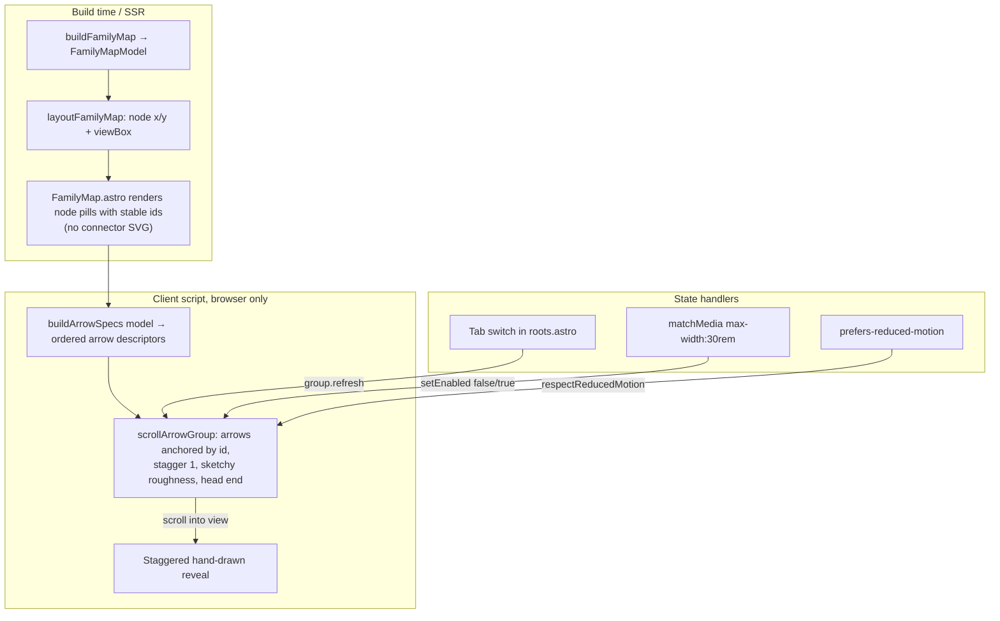

# feat: Integrate scroll-arrows into the Roots page root maps

## Summary

Replace `FamilyMap`'s hand-built SVG connector layer — the computed cubic-elbow
`d` strings in `src/lib/familyMap.ts`, the two `<marker>` arrowheads, and the
`stroke-dashoffset` draw-on-scroll script in `src/components/FamilyMap.astro` —
with the `scroll-arrows` v0.4.0 library (the project owner's own package, npm
`scroll-arrows`, depends on `roughjs`). Each root map becomes a `scrollArrowGroup`
whose hand-drawn, sketchy-curved arrows anchor to the live node DOM elements and
draw in a staggered root → branch → sub-branch reveal as the map scrolls into view.

Node layout (the deterministic vertical fan that positions the `.family-map-node`
pills), the real `<a>` link nodes, the tab switcher, and the mobile vertical
reflow are all kept. Scope is the `/roots` page maps only.

**Decisions carried from the kickoff dialogue:**

- **No-JS fallback: full replace.** The static server-rendered connectors are
  dropped. `scroll-arrows` is progressive-enhancement only (no build-time output),
  so no-JS users see the nodes with no visual tree lines. The relationships still
  survive without JS through the DOM link nodes, the sub-branch `aria-label`s, and
  the narrow-viewport vertical reflow — the connectors were always decorative.
- **Look: sketchy curved.** Lean into the library's signature Excalidraw aesthetic
  — moderate `roughness`, curved arrows with end heads — rather than clean elbow
  brackets. The exact roughness value is a single tunable constant settled by eye
  during implementation (U3).

---

## Problem Frame

The current root maps render connectors as server-side SVG: `layoutFamilyMap`
emits cubic-elbow `d` strings, the component paints them with `pathLength="1"` +
`stroke-dasharray`, and a client script animates `stroke-dashoffset` on
scroll-into-view (re-triggered on tab switch via `IntersectionObserver`). It works,
but the connector geometry is hand-maintained and the look is a clean technical
stroke.

`scroll-arrows` exists to do exactly this job — hand-drawn arrows that auto-anchor
to two elements, track them with `ResizeObserver`, and draw on scroll progress —
and v0.2.0+ closed the interface gaps that previously blocked this integration
(v0.4.0 is the build target; the only interface delta since 0.2.0 is `labelAt`
widening to a `LabelPosition` union, which this integration does not use):

- `scrollArrowGroup` drives a staggered multi-arrow reveal off one shared scroll
  trigger (replaces the manual `--i` stagger).
- Hidden-anchor handling: an anchor inside a `display:none` tab panel draws
  nothing and auto-redraws on reveal, plus an explicit `group.refresh()` hook
  (covers the tab-panel case).
- `setEnabled(on)` + an `enabled` initial flag suspend/restore a group without
  teardown (covers the `matchMedia` breakpoint reflow).
- `respectReducedMotion` (default true) renders arrows fully drawn and static
  under `prefers-reduced-motion: reduce` (covers the existing animation gate).

The work is to swap the connector implementation while preserving everything that
makes the map accessible and responsive.

---

## Requirements

Traceability is to the original families-map requirements (see origin:
`docs/brainstorms/2026-06-13-families-map-requirements.md`); this is a connector-tech
swap under those same constraints, not new product behavior.

- **R1.** Each non-empty root map draws hand-drawn arrows from the root node to its
  branches, and from each branch to its sub-branches, using `scroll-arrows`. (origin R6)
- **R2.** Arrows draw in a staggered reveal when the map scrolls into view; switching
  the active root re-runs the reveal for the newly shown map. (origin R9)
- **R3.** Top-level vs. sub-branch arrows stay visually distinguished (weight/opacity
  or roughness), preserving the hierarchy. (origin R2)
- **R4.** Under `prefers-reduced-motion: reduce`, arrows render fully drawn and static.
  (origin R12 / AE2)
- **R5.** On narrow viewports the map reflows to the vertical stack and arrows are
  suppressed (no absolute overlay over a reflowed layout). (origin R13 / AE6)
- **R6.** Relationships survive without JS: nodes, links, and reflow still convey the
  root→member structure with no connectors. (full-replace decision)
- **R7.** The empty root (Flip, no branches) renders the bare root node with no arrows
  and no errors.

---

## Key Technical Decisions

- **`scrollArrowGroup` per map, one arrow per relationship.** Each `.family-map`
  builds one group; its `arrows[]` are derived in reveal order (a branch, then that
  branch's subs, then the next branch — mirroring today's `wireIndex` flatten order)
  so the cascade reads root-outward. `stagger: 1` for a fully sequential draw.
- **Anchor by stable element id, not geometry.** Nodes get deterministic ids
  (`samap-<family>-root`, `samap-<family>-<branchSlug>`,
  `samap-<family>-<branchSlug>-<subSlug>`) so arrow specs reference live boxes.
  `scroll-arrows` computes all geometry from the laid-out elements — the hand-built
  connector `d` strings are no longer needed.
- **Keep node layout, drop connector geometry.** `layoutFamilyMap` still returns
  root/branch/sub `x`/`y` (placing the pills) and the `viewBox` (driving the figure's
  `aspect-ratio`). The `connector` fields and the `elbow()` helper are deleted.
- **Tab switch → `group.refresh()`.** The roots tab `select()` handler calls the
  revealed map's group `refresh()` so the freshly un-hidden anchors recompute and the
  reveal re-runs — explicit and reliable rather than leaning only on the library's
  auto-reveal observer.
- **Mobile via `setEnabled` + `matchMedia('(max-width: 30rem)')`.** Groups start
  `enabled: !mq.matches`; the change listener toggles every group. Below 30rem the
  layout reflows to the vertical stack (existing CSS) and arrows are off.
- **Reduced motion delegated to the library.** `respectReducedMotion` default true
  replaces the `shouldAnimate` gate for arrows; `shouldAnimate` and its dedicated
  draw script are removed.
- **Fan-out off the shared root edge.** Branches all leave the root's edge; spread
  them with per-branch `startSocketOffset` (evenly distributed by branch index)
  so sibling arrows don't stack on one point.

---

## High-Level Technical Design

Data + control flow after the swap (per root map):



Reveal order within a group (sequential slices, `stagger: 1`):

```
root → branch₁
       branch₁ → sub₁ₐ
       branch₁ → sub₁ᵦ
root → branch₂
       branch₂ → sub₂ₐ
...
```

*Directional guidance — the spec/group shape is authoritative, exact option values
(roughness, socket offsets) are tuned in implementation.*

---

## Implementation Units

### U1. Add `scroll-arrows` dependency and stable node anchors

- **Goal:** Make the integration possible without yet changing behavior — install the
  library and give every map node a stable id arrows can anchor to. The old
  connectors still render after this unit; build stays green.
- **Requirements:** Enables R1.
- **Dependencies:** none.
- **Files:**
  - `package.json` (+ `package-lock.json`) — add `scroll-arrows` to `dependencies`,
    `npm install`.
  - `src/components/FamilyMap.astro` — add `id` attributes to the root node, each
    branch node, and each sub-branch node using the
    `samap-<family>-<slug>` / `samap-<family>-<branchSlug>-<subSlug>` scheme.
- **Approach:** Pure additive. Ids are derived from the already-available `family`
  prop and node `slug`s. No script wiring yet. `roughjs` arrives transitively.
- **Patterns to follow:** Existing `arrowId = \`arrow-${family}\`` id-derivation idiom
  already in `FamilyMap.astro`.
- **Test scenarios:** `Test expectation: none -- dependency + static id attributes,
  no behavioral change. Coverage is the build: `npm run build` / `astro check` pass
  and `npm run validate` is unaffected.`
- **Verification:** `scroll-arrows` resolves in `node_modules`; every node in the
  rendered map carries a unique id following the scheme; existing map still renders
  with its old connectors.

### U2. Derive ordered arrow specs from the map model (pure, tested)

- **Goal:** A browser-free helper that turns a `FamilyMapModel` (+ family slug) into
  the ordered list of arrow descriptors the group will consume — the same testable
  seam as `buildFamilyMap` / `shouldAnimate`.
- **Requirements:** R1, R2, R3, R7.
- **Dependencies:** U1.
- **Files:**
  - `src/lib/familyMap.ts` — add `buildArrowSpecs(model, family)` returning
    `Array<{ startId; endId; sub: boolean; startSocketOffset: number }>`.
  - `src/lib/familyMap.test.ts` — new cases for the helper.
- **Approach:** Emit in reveal order — for each branch: the `root → branch` spec, then
  that branch's `branch → sub` specs — matching today's `wireIndex` flatten order so
  the cascade reads root-outward. `sub: true` flags sub-branch arrows (drives the
  weight/roughness distinction in U3). `startSocketOffset` for `root → branch` specs
  is distributed evenly across branch index (e.g. centered range spread by count) so
  sibling arrows fan off the root edge. Ids use the U1 scheme so specs reference real
  boxes. Empty model → empty array.
- **Patterns to follow:** Pure-helper + unit-test seam of `buildFamilyMap` and
  `shouldAnimate` in the same file; deterministic, no DOM.
- **Test scenarios:**
  - Happy path: a family with 3 branches and no subs → 3 specs, all `startId` = the
    root id, `endId` = each branch id in branch order, `sub: false`.
  - Sub-branches: a branch with 2 subs → its `root → branch` spec is immediately
    followed by 2 `branch → sub` specs with `startId` = the branch id, `endId` = each
    sub id, `sub: true`; the next branch's specs follow after.
  - Reveal order: a model with branch A (1 sub) then branch B → spec order is
    `[root→A, A→subA, root→B]`, not all root arrows first.
  - Fan-out: with N branches, the `root → branch` `startSocketOffset`s are distinct
    and symmetric around 0 (deterministic by index); single-branch case → offset 0.
  - Id scheme: emitted `startId`/`endId` exactly match the id attributes
    `FamilyMap.astro` renders for the same nodes (guard against drift).
  - Covers R7. Empty family (no branches) → `[]`.
- **Verification:** All new cases green; existing `familyMap.test.ts` still passes.

### U3. Wire `scrollArrowGroup` and remove the old connector layer

- **Goal:** The atomic replace — drive the maps with `scroll-arrows` and delete the
  server-rendered connectors, markers, draw script, connector geometry, and animation
  gate they replace.
- **Requirements:** R1, R2, R3, R4, R6.
- **Dependencies:** U1, U2.
- **Files:**
  - `src/components/FamilyMap.astro` — remove the `<svg class="family-map-wires">`
    block (`<defs>` markers + `wires.map(...)`), the `wires`/`wireIndex` setup, and
    the old `<script>` (`shouldAnimate` import, `draw()`, the draw `IntersectionObserver`).
    Add a new client `<script>`: for each `.family-map`, build specs via
    `buildArrowSpecs`, create a `scrollArrowGroup({ arrows, stagger: 1, scroll: { target: <figure> } })`
    with sketchy `roughness`, `head: 'end'`, `stroke: var(--color-rule-strong)`, and
    `sub`-flagged arrows given lighter weight/higher roughness for R3. Skip groups
    for empty maps. Remove the `stroke-dasharray`/`stroke-dashoffset`/`--draw-*` and
    `.family-map-arrowhead` CSS; keep the `aspect-ratio` from `--vb-w/--vb-h` and the
    mobile reflow rules.
  - `src/lib/familyMap.ts` — delete `elbow()`, the `connector` field on
    `PlacedBranch` and on placed sub-branches; keep `x`/`y` and the `viewBox` height
    calc. Remove `shouldAnimate` (and its export) now that the library owns the gate.
  - `src/lib/familyMap.test.ts` — drop connector-string and `shouldAnimate`
    assertions; keep/adjust the node-position and `viewBox` cases.
- **Approach:** Groups are created once at load. Maps in hidden tab panels draw
  nothing until revealed (library auto-handles hidden anchors); U4 adds the explicit
  refresh. Keep a module-level registry of `{ family → group }` so U4's tab/mobile
  handlers can reach them. Arrow overlay mounts in `scroll-arrows`' click-through
  body overlay, so the `<a>` nodes stay clickable. Reduced motion is delegated to
  `respectReducedMotion` (default true).
- **Execution note:** Update the pure-logic tests in `familyMap.test.ts` first (they
  define the trimmed `layoutFamilyMap` contract), then make them green by removing the
  connector code.
- **Patterns to follow:** Inline-script island pattern of `SuperJuiceCalculator.astro`;
  the existing per-`.family-map` `querySelectorAll` loop in the script being replaced.
- **Test scenarios:**
  - `layoutFamilyMap` still returns root/branch/sub `x`/`y` and an unchanged `viewBox`
    for a representative model (node placement must not regress).
  - No residual reference to `connector`, `elbow`, or `shouldAnimate` remains in
    `src/lib/familyMap.ts` exports (the test file importing them would fail to compile
    — a green suite proves the removal is clean).
  - `Test expectation (DOM wiring): none -- the group construction in the Astro
    client script is the untested DOM seam, per the repo's headerProgress convention;
    its logic lives in U2's tested buildArrowSpecs.` Manual verification below covers it.
- **Verification:** On `/roots`, the active map draws hand-drawn sketchy arrows
  root→branch→sub in sequence on load; sub-branch arrows read as subordinate; no-JS
  (disable JS) shows nodes + links + no connectors and no console errors; Flip renders
  a bare root with no arrows; `npm run build` + `npm test` pass.

### U4. Tab-switch refresh, mobile suppression, reduced-motion verification

- **Goal:** Make the groups behave across the page's interactive states — re-reveal on
  tab switch, suppress on narrow viewports, confirm reduced-motion.
- **Requirements:** R2, R4, R5.
- **Dependencies:** U3.
- **Files:**
  - `src/pages/roots.astro` — in the tab `select()` handler, after a panel is
    revealed, call the shown family's `group.refresh()`.
  - `src/components/FamilyMap.astro` (client script) — add the
    `matchMedia('(max-width: 30rem)')` listener that calls `setEnabled(!matches)` on
    every group, and set each group's initial `enabled: !mq.matches`.
- **Approach:** Expose the group registry from the FamilyMap script (e.g. a small
  window-scoped or module-shared map keyed by family) so `roots.astro`'s tab handler
  can call `refresh()` on the right group without re-querying geometry. The
  matchMedia wiring mirrors the README's breakpoint recipe. Reduced motion needs no
  new code — verify the library default holds.
- **Patterns to follow:** The existing `select()` tab handler in `roots.astro`
  (lines ~156–165) already toggles panel `hidden`; hook the refresh right after.
  `matchMedia` + `change`-listener idiom from `BaseLayout.astro`.
- **Test scenarios:**
  - `Test expectation: none -- interactive DOM/matchMedia wiring, untested per the
    headerProgress seam; covered by the manual checks below.`
- **Verification (manual):**
  - Switch from the default root to another tab → the newly shown map re-runs its
    staggered draw (not blank, not pre-drawn).
  - Resize below 30rem → map reflows to the vertical stack and no arrows overlay it;
    resize back above 30rem → arrows return and recompute against the fan layout.
  - OS reduced-motion on → arrows appear fully drawn and static on load and on tab
    switch, with no animation.
  - Cross-tab switching several times leaks no duplicate/stale arrows.

---

## Scope Boundaries

**In scope:** the `/roots` page maps (`FamilyMap.astro`, `familyMap.ts`,
`roots.astro`), the `scroll-arrows` dependency, removal of the old connector layer.

**Out of scope (true non-goals):**

- Extending the hand-drawn motif to other pages or components — the brainstorm framed
  the map as a "flagship instance" of a reusable motif, but this plan does not build
  the general abstraction.
- Changing the node-positioning algorithm (the deterministic vertical fan stays).
- Taxonomy, recipe data, or `related[]` changes.
- A no-JS static-connector fallback — explicitly dropped by the full-replace decision.

---

## Risks & Dependencies

- **Bundle size.** `scroll-arrows` pulls `roughjs` onto the `/roots` route. Expected
  small, but confirm the route's JS weight is acceptable after U3.
- **Body overlay + scaling.** Arrows mount in a document-body overlay positioned in
  document coords and tracked by `ResizeObserver`; the figure scales via
  `aspect-ratio`. Verify arrows stay glued to nodes through scroll and resize, and
  that the click-through overlay never blocks the `<a>` nodes.
- **Hidden-panel first paint.** Five of six maps start in `display:none` panels;
  confirm their groups draw correctly only once revealed (U4 refresh) and that the
  default-visible map draws on load without a scroll.
- **Aesthetic fit.** Sketchy-curved arrows are a real visual departure from the clean
  tree; the roughness constant (U3) is the taste dial — settle it by eye on the page.
- **Dependency:** the library is the owner's own package; v0.4.0 is the integration
  target. No external research — the README + shipped types are authoritative. The
  only API change across 0.2.0→0.4.0 is `labelAt` typing, which this plan doesn't use.

---

## Sources & Research

- `scroll-arrows` v0.4.0 README and `dist/*.d.ts` (local: `~/projects/scroll-arrows`;
  npm `scroll-arrows@0.4.0`) — `scrollArrowGroup`, hidden-anchor reveal + `refresh()`,
  `setEnabled`/`enabled`, `respectReducedMotion`, socket offsets, `route`, `head`.
- Origin requirements: `docs/brainstorms/2026-06-13-families-map-requirements.md`
  (R2, R6, R9, R12, R13; AE2, AE6).
- Origin plan: `docs/plans/2026-06-13-001-feat-families-map-plan.md` (the connector
  + draw-on-scroll system being replaced; the pure-helper test seam).
- Current implementation: `src/components/FamilyMap.astro`, `src/lib/familyMap.ts`,
  `src/lib/familyMap.test.ts`, `src/pages/roots.astro`.
