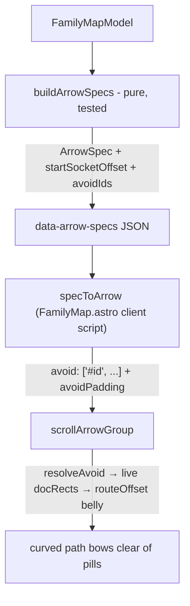

# Root-Map Arrow Obstacle Avoidance - Plan

## Goal Capsule

- **Objective:** On the `/roots` family maps, arrows render as clean rounded paths that avoid pill obstacles — no branch→sub arrow clips a sibling sub pill, and no root→branch arrow crosses intermediate pills. Implements GitHub issue #105.
- **Authority:** This plan > issue #105 > prior plan `docs/plans/2026-06-21-001-feat-scroll-arrows-root-maps-plan.md` (context only).
- **Stop conditions:** Stop and surface if the scroll-arrows 0.4.x single-bend router cannot produce acceptable results even with minimal obstacle lists — do not fork or patch the library inline; file the gap as an issue on `dancj/scroll-arrows` (U4) and ship the best achievable result.
- **Execution profile:** TDD for the pure spec logic (U1); DOM wiring and tuning verified by build + visual check per repo convention.

---

## Product Contract

### Summary

The root maps draw connectors with the `scroll-arrows` library. Routing is heuristic: all branch→sub arrows leave the same bottom-center socket, and no arrow knows about the pills between its endpoints. When a branch has 2+ subs (Manhattan → Maple Bacon, Oaxaca) the arrows run close together and can clip the upper sub. This work fans the start sockets and feeds relationship-derived obstacle lists into scroll-arrows' `avoid` option so curves bow around pills instead of crossing them.

### Problem Frame

`buildArrowSpecs` (pure, unit-tested, `src/lib/familyMap.ts`) already fans root→branch sockets via `startSocketOffset`, but emits `0` for every sub arrow and carries no obstacle information. `specToArrow` (`src/components/FamilyMap.astro`) never sets `avoid`, so the single-bend router in scroll-arrows is unused. Because `avoid` resolves live DOM elements at every refresh, feeding it node ids also gets real DOM-measured pill rects for free — the geometry no longer needs to be blind to actual pill widths.

### Requirements

- R1. Branch→sub arrows for a branch with 2+ subs leave distinct points on the branch's bottom edge (fanned sockets) and do not clip sibling sub pills.
- R2. Root→branch arrows do not cross the branch or sub pills that sit between the root and the target branch. U3's before-pass verifies whether any crossing actually occurs today; if none does, R2 is satisfied by existing behavior and no root→branch obstacle machinery ships.
- R3. Arrows stay smooth rounded curves with the existing hand-drawn look (`route: 'curved'`, current roughness/stroke values unchanged).
- R4. Obstacle lists and socket offsets are computed in pure `buildArrowSpecs`, unit-tested; `specToArrow` stays a thin mapping.
- R5. No regression to existing behaviors: draw-on-reveal per tab, scroll/reflow realign glue, reduced-motion snap, arrows disabled below the 30rem breakpoint, empty-family (Flip) no-op.
- R6. Library gaps that block or degrade the result are filed as issues on `dancj/scroll-arrows` with concrete repro details; the plan does not block on library releases.

### Scope Boundaries

- **In scope:** `src/lib/familyMap.ts` spec logic, `src/components/FamilyMap.astro` wiring/tuning, tests in `src/lib/familyMap.test.ts`.
- **Deferred to Follow-Up Work:** runtime pill-rect measurement feeding back into *layout* positions (lane repositioning); force/collision layout pass; per-family hand tuning; any scroll-arrows library changes themselves (tracked via U4 issues in that repo).
- **Out of scope:** mobile (<30rem) stacked reflow — arrows are off there; node geometry constants (`ROW_HEIGHT`, `BRANCH_X`, …) except where visual tuning in U3 demands a nudge.

### Assumptions

- The single-bend `avoid` router is sufficient for the short branch→sub chords, where blockers sit mid-chord and the belly has authority. It is NOT assumed sufficient for root→branch arrows: `routeOffset` measures clearance against the straight start→end chord (not the rendered curve), and the gutter chord (root-left x=60 to branch-left x=96) passes left of every pill — blockers can only register near the arrow's end, exactly where a both-control-point belly attenuates toward zero. Root→branch avoidance is therefore a U3-verified experiment, not a planned mechanism.
- `scroll-arrows` stays at `^0.4.0`; improvements land later via the sibling repo, not this PR.

---

## Planning Contract

### Key Technical Decisions

- **KTD1 — Use `avoid` with relationship-derived obstacle ids.** `buildArrowSpecs` adds `avoidIds: string[]` per spec, listing only the node ids spatially between the arrow's endpoints. `specToArrow` maps them to `#id` selectors. scroll-arrows resolves the elements at every refresh (`resolveAvoid` → `docRect`), so real pill widths are picked up live — no separate measurement pass.
- **KTD2 — Fan sub-arrow start sockets.** Mirror the existing `SOCKET_SPREAD` pattern: for a branch with k ≥ 2 subs, spread `startSocketOffset` along the branch's bottom edge, ordered so lower subs leave further from the target side and arrows nest without crossing (exact sign/spread constant settled visually in U3; directional guidance, not specification).
- **KTD3 — Keep `route: 'curved'`.** Elbow mode ignores `avoid` and `curvature` and loses the hand-drawn bow; the goal is rounded paths, so curved + belly routing is the mechanism.
- **KTD4 — Minimal obstacle lists, scoped to branch→sub arrows.** The router is single-bend: it clears the *worst* blocker, measured against the straight chord. Branch→sub arrow *j* avoids only earlier sibling subs `0..j-1` — short chords with mid-chord blockers, where the router's model holds. Root→branch arrows ship with NO `avoidIds` by default: their chord runs in the empty gutter left of all pills, so chord-based detection either sees nothing or fires only end-adjacent where the belly has no authority. If U3's before-pass shows a real root→branch crossing, add root→branch `avoidIds` there as a verified experiment and keep it only if it demonstrably fixes the crossing; otherwise escalate straight to U4.
- **KTD5 — No layout changes.** Deterministic geometry in `layoutFamilyMap` stays as-is; avoidance happens in arrow routing, not node placement.

### High-Level Technical Design

### Risks

- **Realign cost:** the realign glue runs rAF-throttled on scroll; each arrow now resolves its obstacles' rects per refresh. Daiquiri (11 branches) is the stress case. The refresh loop already interleaves each arrow's rect reads with SVG writes (path appends + `getTotalLength`), so per-arrow reflow boundaries pre-exist this change; the new obstacle reads land in the same flushed read batch as the anchor rects, so the marginal cost is a few extra `getBoundingClientRect` calls per arrow. Expected fine — verify by feel in U3; if it stutters, that's a U4 issue candidate (group-level rect caching in scroll-arrows).
- **Single-bend limits:** the router tests clearance against the straight chord, not the rendered bezier (which adds curvature reach plus a 1.6x belly amplification) — a curve can clip a pill whose chord clears it, in which case no belly is emitted at all. `avoidPadding` is both the trigger threshold and the bow clearance, so widening it is the first knob for that mode. But when a blocker sits near an arrow's *end*, the belly attenuates toward zero there and an additive padding bump cannot offset the multiplicative attenuation — that case escalates directly to U4, not a padding-tuning loop.

---

## Implementation Units

### U1. Socket fanning and avoid lists in buildArrowSpecs

- **Goal:** `ArrowSpec` carries per-sub `startSocketOffset` fanning and a new `avoidIds: string[]` computed from the model's relationships.
- **Requirements:** R1, R2, R4.
- **Dependencies:** none.
- **Files:** `src/lib/familyMap.ts`, `src/lib/familyMap.test.ts`.
- **Approach:** Extend the `ArrowSpec` interface with `avoidIds`. Sub spec *j* under branch *i* gets earlier sibling sub ids `0..j-1` and a fanned `startSocketOffset` (new `SUB_SOCKET_SPREAD` constant; lone sub stays `0`). Root→branch specs get empty `avoidIds` (see KTD4 — root→branch avoidance is a U3-verified experiment, not shipped by default). First sub gets empty `avoidIds`.
- **Execution note:** TDD — repo mandate; this is the tested pure seam.
- **Patterns to follow:** existing `SOCKET_SPREAD` fan math and the `buildArrowSpecs` test style in `src/lib/familyMap.test.ts` (model fixtures via the local `recipe()` helper).
- **Test scenarios:**
  - Branch with 3 subs: sub specs get distinct `startSocketOffset` values, symmetric about center and monotonic, asserted relative to the sign of `SUB_SOCKET_SPREAD` (e.g., offsets equal `(j/(k-1)-0.5)*SUB_SOCKET_SPREAD`) so U3 sign/spread tuning changes only the constant, never the assertions.
  - Branch with 1 sub: offset stays `0`, `avoidIds` empty.
  - Sub spec *j* lists exactly the ids of earlier siblings `0..j-1`, in order.
  - Every root→branch spec: `avoidIds` empty (per KTD4).
  - Empty family: no specs (existing behavior unchanged).
  - Existing root→branch `SOCKET_SPREAD` fan tests still pass unchanged.
- **Verification:** `npm test` green; new tests fail before implementation (red observed), pass after.

### U2. Wire avoid + offsets into specToArrow

- **Goal:** The client script feeds `avoidIds` and tuning knobs into scroll-arrows.
- **Requirements:** R2, R3, R4.
- **Dependencies:** U1.
- **Files:** `src/components/FamilyMap.astro`.
- **Approach:** In `specToArrow`, map `s.avoidIds` to `avoid: s.avoidIds.map(id => '#' + id)` (omit when empty), set an `avoidPadding` suited to the pill gap (~10–16px; default is 14). Leave roughness/stroke/head/sockets as they are. No other wiring changes — the group lifecycle (play/redraw/realign) is untouched.
- **Execution note:** DOM wiring — skip unit tests per repo convention (`headerProgress` seam pattern); prove via build + U3 visual pass.
- **Test scenarios:** Test expectation: none — thin declarative mapping of tested spec data; covered by U3 visual verification and `astro check` typing against `ScrollArrowOptions`.
- **Verification:** `npm run build` (includes `astro check`) passes.

### U3. Visual verification and tuning

- **Goal:** Arrows look clean on every family; constants (`SUB_SOCKET_SPREAD`, `avoidPadding`, offset sign/order) settled against real rendering.
- **Requirements:** R1, R2, R3, R5.
- **Dependencies:** U1, U2.
- **Files:** `src/lib/familyMap.ts` (constant nudges), `src/components/FamilyMap.astro` (padding nudges).
- **Approach:** **Before-pass first:** capture the current `/roots` rendering and record whether any root→branch arrow actually crosses an intermediate pill. If none does, R2 is satisfied by existing behavior — ship no root→branch obstacle machinery. If a real crossing exists, add root→branch `avoidIds` as an experiment and keep it only if the after-pass shows the crossing demonstrably fixed (per KTD4; if not fixed, escalate to U4). Then build and inspect the stress cases: Old Fashioned (4 branches, Manhattan with 2 subs — the issue's screenshot case), Daiquiri (11 branches, busiest gutter), Sidecar/Whiskey Highball, Flip (empty — must stay a no-op). Check tab-switch replay, scroll realign glue, reduced-motion snap, and sub-30rem arrow shutoff still behave.
- **Test scenarios:** Test expectation: none — visual tuning of constants; behavioral invariants already covered by U1 unit tests and existing suite.
- **Verification:** Screenshots of before/after for the Manhattan sub fan; no pill clipped by an arrow on any family; `npm test` and `npm run build` green.

### U4. File scroll-arrows improvement issues (conditional)

- **Goal:** Library gaps observed during U1–U3 become tracked issues on `dancj/scroll-arrows` so future releases can improve routing.
- **Requirements:** R6.
- **Dependencies:** U3 (findings feed the issues).
- **Files:** none in this repo.
- **Approach:** For each gap actually observed, file one issue via `gh issue create --repo dancj/scroll-arrows` with repro geometry from the root maps. Known candidates going in (file only if observed): single-belly under-clearing on long arrows with an end-adjacent blocker; no S-bend when obstacles need opposite sides; per-refresh obstacle rect resolution with no group-level caching (realign perf). If nothing surfaces, record "none needed" in the PR body.
- **Test scenarios:** Test expectation: none — external issue filing, no code.
- **Verification:** Issue URLs (or the explicit "none needed" note) in the PR description.

---

## Verification Contract

| Gate | Command | Applies to |
|---|---|---|
| Unit tests (Vitest) | `npm test` | U1 red-green, full suite after every unit |
| Types + content + Pagefind | `npm run build` (runs `astro check`) | U2, U3 |
| Recipe/frontmatter validation | `npm run validate` | untouched by this work; must stay green |
| Visual pass | manual `/roots` inspection, all family tabs | U3 |

---

## Definition of Done

- All R1–R5 satisfied; R6 satisfied by filed issues or an explicit "none needed" note.
- `npm test` and `npm run build` green.
- U1 test scenarios all present and passing; no existing test modified except where the `ArrowSpec` shape extension requires fixture updates.
- Manhattan 2-sub fan case (issue #105 screenshot) visibly resolved: distinct sockets, no clipped pill.
- No dead experimental code left in the diff; constants carry brief comments in the existing file style.
- Ships as a PR from a `fix-105-arrow-routing-overlaps` branch with `Closes #105` in the body.
