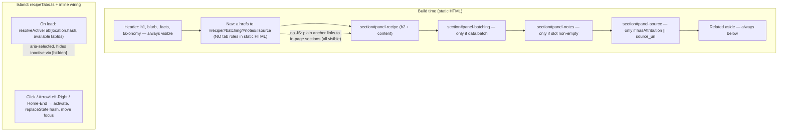

# feat: Tab the drink detail page (recipe / batching / notes / source)

## Summary

The recipe detail page (`src/layouts/RecipeLayout.astro`) stacks every section vertically — ingredients, house-made preps, steps, batching math, markdown notes, attribution — so the spec you need mid-pour gets pushed down by content you need occasionally. Reorganize the body into a tabbed view: **Recipe** (default), **Batching**, **Notes**, **Source**. Tabs are a progressive-enhancement island over semantic stacked sections: **zero-JS degrades to today's scroll**, JS upgrades to ARIA tabs with hash deep-linking. Empty tabs are derived from existing data — **no frontmatter schema change** — and print/Pagefind both see every panel.

Closes #170.

---

## Problem Frame

- **What's wrong:** One long vertical scroll on the detail page. The "make the drink" content (glass/method, ingredients, steps) competes for position with batching math, tasting notes, and attribution that are read rarely.
- **Where:** `src/layouts/RecipeLayout.astro` — the single layout for `/recipes/<slug>/`, rendered by `src/pages/recipes/[id].astro`.
- **Constraints that shape the fix:**
  - Static Astro on GitHub Pages. No SSR, no framework runtime — an island is a plain `<script type="module">`, same as the existing header-progress island in `BaseLayout.astro`.
  - Pagefind indexes the built static HTML (`data-pagefind-body` on `<article>`). Content must stay in the DOM at build time or it drops out of search.
  - The body is a **mix of Astro components** (`Ingredients`, `HouseMade`, `Steps`, `BatchInstructions`) **and an opaque markdown `<slot />`** (`## Notes`, `## Variations`). The slot is a single rendered blob — it is not split further.

---

## Requirements

Traceability back to issue #170.

- **R1** — Body reorganized into tabs: Recipe (default), Batching, Notes, Source.
- **R2** — Progressive enhancement: works with JS off by degrading to plain stacked sections (today's behavior). No heavy component.
- **R3** — Deep linking: visiting `/recipes/<slug>/#batching` opens with that tab active; tab activation updates the URL hash so links are shareable.
- **R4** — Pagefind still indexes content in inactive tabs; search results still resolve to the page (verify sub-result anchors land on the right tab).
- **R5** — Mobile: the tab strip fits narrow viewports with no horizontal page scroll.
- **R6** — Print: all tabs expand to a single stacked document.
- **R7** — Empty tabs are hidden, not shown empty (most recipes have no batching data; many have no attribution).
- **R8** — Accessibility: keyboard-operable tabs with correct ARIA roles when JS is on; semantic headings when JS is off.

---

## Key Technical Decisions

**KTD1 — Progressive-enhancement island, not CSS `:target` tabs.**
Render the body as semantic stacked `<section>`s (each with an `<h2>` and `id`) that are the no-JS fallback verbatim — this is essentially today's page. A small client island (`src/scripts/recipeTabs.ts` pure logic + inline wiring in the layout) upgrades them to an ARIA tablist/tabpanel set on load.
*Chosen over* CSS `:target`/radio-hack tabs because the issue explicitly sanctions "degrade to plain stacked sections," the repo already ships this exact island pattern (`headerProgress`), and `:target` tabs have a weak default-state story and poor keyboard/ARIA semantics. *Rejected* a component library — overkill, adds a dependency, fails the "not a heavy component" constraint.

**KTD2 — No frontmatter/schema change. Tab presence is derived.**
The issue flags "may need optional frontmatter fields." It doesn't. Presence is derivable from existing data:
- **Batching** renders iff `data.batch` is set.
- **Source** renders iff `hasAttribution || data.attribution.source_url`. The layout's existing `hasAttribution` only checks creator/bar/year, so a borrowed classic whose sole attribution is a `source_url` link would otherwise lose its Source tab — widen the gate to include `source_url`.
- **Notes** renders iff the rendered markdown slot is non-empty — check via `const notesHtml = (await Astro.slots.render('default')).trim()` and gate on `notesHtml.length > 0`.
- **Recipe** always renders (ingredients/steps are the floor of a recipe).

*Chosen over* adding schema fields because it means zero changes to `content.config.ts`, `TEMPLATE.md`, `scripts/validate.mjs`, taxonomy codegen, or every existing recipe file — a far smaller, lower-risk diff. `Astro.slots.render()` returns the rendered HTML string, so emptiness is detectable at build time without new metadata.

**KTD3 — Drink identity stays above the tabs; Related stays below.**
Keep `<h1>`, blurb, the `.facts` strip (glass/method/ice/difficulty), and the taxonomy chips in the always-visible header — they're the drink's identity and a compact at-a-glance reference that shouldn't vanish when you switch to Batching. The **Related** aside stays below the tab strip (it's cross-navigation, not detail content). Only the four content zones (Ingredients+Steps+HouseMade, Batching, Notes, Source) tab.
*Note on issue intent:* #170 lists "glass, garnish, method" under the Recipe tab. Garnish already lives with Ingredients (moves with it). Glass/method stay in the always-visible facts strip rather than inside the Recipe tab — same information, better ergonomics, negligible extra height. See **Open Questions Q1** if the reviewer wants strict issue grouping instead.

**KTD4 — Tab content mapping.**
- **Recipe** (default): `Ingredients` (with garnish/float) + `HouseMade` + `Steps`. House-made syrups are part of building the drink, so they live here, not in Batching.
- **Batching**: `BatchInstructions` (scaled quantities, dilution, bottle math, storage).
- **Notes**: the markdown `<slot />` (`## Notes`, `## Variations`, tasting notes).
- **Source**: the attribution aside.

**KTD5 — Build-time HTML is plain semantic sections; the island adds tab roles AND hides panels on load.**
The **static HTML carries no tab ARIA** — just `<h2>` sections with ids and a row of `<a href="#id">` jump links. The island, on hydration, *adds* `role="tablist"`/`role="tab"`/`role="tabpanel"`, `aria-selected`, roving `tabindex`, and sets `hidden` on inactive panels. This is load-bearing: baking `role="tab"`/`aria-selected` into static markup while every panel is visible (the no-JS and pre-hydration state) asserts a tab widget whose contract isn't met — a screen reader announces "tab, selected" over a fully-stacked page, which is worse than plain links and contradicts R2/R8. Emitting roles only when the behavior exists keeps the no-JS path honest.

All panels are present and visible in the build-time HTML (island runs client-side only), so **Pagefind indexes everything** and no-JS users see the full stack. Panels hide via the `hidden` attribute (JS-toggled), never removed. Print CSS overrides with `@media print { .recipe-tabpanel[hidden] { display: block !important } .recipe-tablist { display: none } }`.

**Pre-paint flash mitigation:** an inline `<head>` snippet sets a `js` class on `<html>` before first paint; `.js .recipe-tabpanel:not([data-default]) { display: none }` hides non-default panels before the island runs, so JS users don't see all panels flash then collapse (a real CLS/reflow, not just cosmetic). The class is absent with JS off, so no-JS users keep the full stack. Mirrors the existing `is:inline` head snippet in `BaseLayout.astro`.

---

## High-Level Technical Design

**No-JS path:** the tablist is a row of same-page anchor links (`<a href="#batching">`); all sections are visible and stacked; clicking an anchor scrolls to the section. Identical to today plus in-page jump links.

**JS path:** island reads the hash, hides inactive panels, wires `role`/`aria-selected`/`aria-controls`/keyboard nav, and syncs the hash on activation (via `history.replaceState` so back-button isn't polluted per tab click).

---

## Implementation Units

### U1. Restructure RecipeLayout body into semantic tab sections

**Goal:** Replace the flat `.recipe-body` block with a tablist + stacked `<section role="tabpanel">` panels, computing which panels render. No client behavior yet — output is a valid no-JS stacked page.

**Requirements:** R1, R2, R7, R8, KTD2, KTD3, KTD4, KTD5.

**Dependencies:** none.

**Files:**
- `src/layouts/RecipeLayout.astro` (modify)

**Approach:**
1. Before markup, compute panel presence:
   - `const notesHtml = (await Astro.slots.render('default')).trim();` → `hasNotes = notesHtml.length > 0`.
   - `hasBatch = !!data.batch`, `hasSource = hasAttribution` (already computed).
   - Build an ordered `tabs` array of `{ id, label }` from `['recipe', ...(hasBatch?['batching']:[]), ...(hasNotes?['notes']:[]), ...(hasSource?['source']:[])]`.
2. Keep the existing `<header class="recipe-header">` (h1/blurb/facts/taxonomy) unchanged and above the tabs.
3. Render a `
` containing **plain semantic markup — no tab ARIA roles in the build output** (KTD5; the island adds them):
   - `<nav class="recipe-tablist" aria-label="Recipe sections">` with one `<a href={"#panel-"+id} id={"tab-"+id}>{tabLabel}</a>` per tab. No `role`, no `aria-selected` here.
   - One `<section class="recipe-tabpanel" id={"panel-"+id} data-tab={id}>` per tab, in the same order, each led by its own `<h2>`. **Panel ids are namespaced `panel-<id>`** to avoid colliding with markdown heading auto-slugs (`## Notes` → `#notes`); a duplicate `id="notes"` would break `aria-controls` and the heading-anchor fallback (see U2). Mark the default (`recipe`) panel with `data-default` for the pre-paint hide (KTD5).
   - **Recipe panel:** `Ingredients` + `HouseMade` + `Steps` (move existing component calls here).
   - **Notes panel:** render `notesHtml` via `<Fragment set:html={notesHtml} />` instead of `<slot />` (the slot was consumed by `Astro.slots.render`). **This panel must carry `class="recipe-body"` and `style={mdHeadingIcons}`** — the markdown typography (`:global(h2/h3/p/li/em/strong)`) and the `## Notes`/`## Variations` heading icons are all scoped under `.recipe-body` and driven by the inline `--icon-notes`/`--icon-variations` custom props; move both the class and the inline style onto this section or the notes lose their type and icons silently (no build error).
   - **Batching panel:** `BatchInstructions`. **Source panel:** the attribution `<aside>` inner content (drop the standalone `data-pagefind-ignore` wrapper or keep the ignore — see U4).
4. Keep the Related aside below `.recipe-tabs`.
5. Single-tab case (only Recipe): if `tabs.length === 1`, omit the `<nav>` tablist and render the lone `<section>` with its `<h2>` un-tabbed. Because tab roles are JS-applied (KTD5), the island simply skips role application when there's one panel — no orphan `role="tabpanel"` with no owning tab.

**Patterns to follow:** existing component composition in the current `.recipe-body`; `Astro.slots.render` usage is standard Astro. Icon usage per `BatchInstructions`/`HouseMade`.

**Execution note:** Verify the rendered no-JS HTML first (view source / `astro build`): every section present and visible, garnish still with ingredients, attribution content intact. This unit must be correct before the island hides anything.

**Test scenarios:**
- `Test expectation: none — pure Astro markup restructure with no extracted logic.` Emptiness/ordering logic that *is* testable is extracted in U2 (`buildTabList`) and tested there. Verification here is build + visual (view-source) per the execution note.

**Verification:** `npm run build` succeeds (`astro check` clean); a recipe with batch + attribution + notes renders four sections; a recipe with none of those renders only the Recipe content and no tablist; garnish/float still render inside Ingredients.

---

### U2. Tab logic module + client island wiring

**Goal:** Add the progressive-enhancement behavior: on load, resolve the active tab from the hash and hide inactive panels; wire click + keyboard activation; sync the hash. Extract the pure decision logic into a tested module.

**Requirements:** R2, R3, R8, KTD1, KTD5.

**Dependencies:** U1.

**Files:**
- `src/scripts/recipeTabs.ts` (create — pure functions)
- `src/scripts/recipeTabs.test.ts` (create)
- `src/layouts/RecipeLayout.astro` (modify — add inline `<script type="module">` wiring)

**Approach:**
1. `recipeTabs.ts` exports pure, DOM-free functions (vitest env is `node` — no jsdom, mirror `headerProgress.ts`):
   - `buildTabList(flags: { hasBatch: boolean; hasNotes: boolean; hasSource: boolean }): string[]` → ordered panel ids, always starting with `'recipe'`. (Shared shape with U1's inline computation; U1 may import it to avoid drift.)
   - `resolveActiveTab(hash: string, available: string[]): string` → strip leading `#`; return the matching id if present in `available`, else `available[0]`. Handles empty hash, unknown hash, and a hash pointing at a *heading inside* a panel (see step 3).
2. Inline wiring in `RecipeLayout.astro` (module `<script>`, guarded by `document.querySelector('[data-recipe-tabs]')`). On init, **add** the ARIA that was deliberately kept out of static markup (KTD5):
   - Set `role="tablist"` on the `<nav>`, `role="tab"` + `aria-controls="panel-<id>"` on each link, `role="tabpanel"` + `aria-labelledby="tab-<id>"` + `tabindex="0"` on each panel. (`tabindex="0"` lets keyboard users Tab into a text-only panel and receive programmatic focus.)
   - Resolve the active tab (`resolveActiveTab(location.hash, ids)`), set `hidden` on inactive panels, `aria-selected` + roving `tabindex` (0 active / -1 inactive) on tabs.
   - **Click a tab** (tablist interaction): `preventDefault`, activate, `history.replaceState(null,'','#panel-'+id)`, keep focus on the tab (automatic-activation).
   - **Keyboard on the tablist:** ArrowLeft/Right cycle, Home/End jump, activate on focus-follow (roving `tabindex`).
   - **Hash-driven activation** (initial load with a non-default hash, and `hashchange` — covers Pagefind result clicks and cross-recipe `#panel-batching`/`#heading` links): activate the target panel **and move focus to it** (`panel.focus()`), so a screen-reader/keyboard user who followed a search result isn't left with the visible panel silently swapped under a stale focus position (R4/R8).
3. **Heading-anchor fallback (R4):** a hash may target a markdown heading *inside* a panel (`#storage`), not a panel id. Resolve via the DOM: if `hash` isn't a panel id, `document.getElementById(hash)?.closest('.recipe-tabpanel')` gives the owning panel. Using `closest()` (not a raw id match) is what makes the namespaced panel ids from U1 safe against heading-slug collisions. Keep `resolveActiveTab` pure over the panel-id list; do the heading→panel DOM lookup in the wiring and feed the resulting panel id in.

**Patterns to follow:** `src/scripts/headerProgress.ts` (pure fn + doc comment) and its inline wiring in `BaseLayout.astro` lines 122+; `src/scripts/headerProgress.test.ts` for test shape.

**Execution note:** Write `recipeTabs.test.ts` first for `resolveActiveTab`/`buildTabList` (pure, fast), then wire the DOM. DOM wiring itself is verified in-browser, not unit-tested (no jsdom in this repo).

**Test scenarios (`src/scripts/recipeTabs.test.ts`):**
- `buildTabList` with all flags true → `['recipe','batching','notes','source']`.
- `buildTabList` with all false → `['recipe']`.
- `buildTabList` with only `hasNotes` → `['recipe','notes']` (order preserved, no gaps).
- `resolveActiveTab('#batching', ['recipe','batching','notes'])` → `'batching'`.
- `resolveActiveTab('', ['recipe','batching'])` → `'recipe'` (empty hash → first).
- `resolveActiveTab('#nonsense', ['recipe','batching'])` → `'recipe'` (unknown → first).
- `resolveActiveTab('#batching', ['recipe'])` → `'recipe'` (target tab absent for this recipe → first, no crash).
- `resolveActiveTab('batching', [...])` (no leading `#`) → `'batching'` (tolerant of both forms).

**Verification:** `npm test` passes new cases; in a browser, `#batching` opens on the Batching tab, arrow keys move tabs, activating a tab updates the URL, and JS-off (or before hydration) shows all sections stacked.

---

### U3. Tab styling — desktop, mobile, print

**Goal:** Style the tablist and panels; make the strip fit narrow viewports without horizontal *page* scroll; expand all panels for print.

**Requirements:** R5, R6, KTD5.

**Dependencies:** U1 (markup), U2 (active-state hooks).

**Files:**
- `src/layouts/RecipeLayout.astro` (modify — `<style>` block)

**Approach:**
1. Tablist: horizontal row of tab links using existing tokens (`--font-sans`, `--color-rule`, `--color-accent` for the active underline), matching the eyebrow/`.facts` visual language already in this file.
2. Active tab: `[aria-selected="true"]` gets the accent underline/weight; inactive muted.
3. **Mobile (R5):** let the four short tabs wrap to a second row (`flex-wrap: wrap` on `.recipe-tablist`) rather than scroll horizontally. Wrapping never hides a tab, needs no scroll affordance, works with a keyboard, and is cheaper than an `overflow-x: auto` strip whose off-edge tabs would vanish silently under large text / 200% zoom. Either way the page body stays fixed width (no *page* h-scroll). Accordion is deferred — see Scope Boundaries.
4. **Print (R6):** `@media print { .recipe-tablist { display: none } .recipe-tabpanel[hidden] { display: block !important } }` so a printed recipe is the full stacked document.
5. Respect existing `.recipe-body` typography — panels reuse the same `:global(h2/p/li)` treatment (keep those selectors, retarget to `.recipe-tabpanel` as needed).

**Patterns to follow:** the `<style>` block already in `RecipeLayout.astro` (tokens, eyebrow styling, `:global()` for slotted markdown).

**Execution note:** Mostly CSS; verify by build + browser at 360px and print preview rather than unit tests.

**Test scenarios:**
- `Test expectation: none — pure styling/layout. Verified via browser + print preview.`

**Verification:** at 360px viewport the page has no horizontal scrollbar; print preview shows all sections expanded and the tablist hidden; active tab is visually distinct in light and dark themes.

---

### U4. Pagefind indexing + deep-link verification

**Goal:** Confirm hidden-tab content is still indexed and that search results deep-link to the correct tab. Add heading anchors if needed for sub-result targeting.

**Requirements:** R4.

**Dependencies:** U1, U2.

**Files:**
- `src/layouts/RecipeLayout.astro` (modify only if anchor ids are missing)

**Approach:**
1. `npm run build` (runs `pagefind --site dist`), then search the built site for a term that lives only in a **Batching** or **Notes** section (e.g. a batch storage note). Confirm the result appears — proves hidden-panel content is indexed (it is present + visible in build-time HTML).
2. Click a Pagefind sub-result and confirm the `#heading` hash lands on the correct tab via U2's heading-anchor fallback. If markdown headings lack stable ids, confirm Astro's rehype auto-slug is on (it is by default) so `## Storage` → `#storage`.
3. Confirm the attribution/`data-pagefind-ignore` decision from U1: if attribution should be searchable, drop the ignore; if not, keep it. Default: keep current behavior (attribution ignored) unless the reviewer wants Source searchable.

**Execution note:** Verification-only unit; no new logic expected. Any code change here is a small markup/anchor tweak.

**Test scenarios:**
- `Test expectation: none — build-and-verify unit. Pagefind runs at build; deep-link behavior covered by U2's resolveActiveTab tests plus manual search verification.`

**Verification:** a Batching-only term returns its recipe in site search; clicking through opens the Batching (or heading's) tab, not a blank Recipe tab.

---

## Scope Boundaries

**In scope:** `src/layouts/RecipeLayout.astro` restructure + styles, `src/scripts/recipeTabs.ts` (+ test), Pagefind/deep-link verification.

**Out of scope / non-goals:**
- No recipe content rewrites — existing sections map onto tabs as-is (per issue).
- No frontmatter schema, `TEMPLATE.md`, `validate.mjs`, or taxonomy changes (KTD2).
- No change to any page other than the recipe detail layout.

### Deferred to Follow-Up Work
- **Accordion on narrow viewports.** The issue floats an accordion as a mobile *option*; the horizontal-scroll tablist (U3) satisfies "no horizontal page scroll" more cheaply. Revisit only if four tabs prove cramped in practice.
- **Cross-recipe `#batching` deep links in recipe bodies.** The mechanism ships (R3); authoring such links in recipe markdown is content work, not this layout change.

---

## Open Questions

Non-blocking — sensible defaults are in the plan; flag for the reviewer (Dan) if a different call is wanted. None changes the unit structure.

- **Q1 — Glass/method placement.** Issue #170 lists "glass, garnish, method" under the Recipe tab; the plan (KTD3) keeps glass/method in the always-visible `.facts` strip instead. *Default:* facts strip stays above the tabs (glass/method never disappear when switching to Batching). Switch to strict issue grouping only if the always-visible strip feels redundant.
- **Q2 — Does tabbing target the actual mid-pour scroll?** *(Adversarial review, report-only.)* The current layout already renders ingredients → house-made → steps first, with batch/notes/attribution below. So the content moved behind tabs (batch/notes/source) was already past the fold and wasn't pushing the spec down. The one genuine mid-pour interruption is a long `HouseMade` syrup block sitting *between* ingredients and steps — and KTD4 keeps it inside the Recipe tab, so the pour-time scroll is largely unchanged. Tabs still deliver the issue's stated goal (a clean default view, occasional content one tap away) and are what #170 explicitly asks for, so the plan proceeds. *Cheaper adjacent win worth considering:* reorder `Steps` before `HouseMade`, or wrap `HouseMade` in `
`, inside the Recipe tab — a ~5-line change that actually shortens the mid-pour scroll. Left out of scope pending Dan's call; not a blocker.

---

## Risks & Dependencies

- **Slot consumed by `Astro.slots.render`.** Once `await Astro.slots.render('default')` is called, `<slot />` is spent — the Notes panel must render the captured `notesHtml` via `set:html`, not a second `<slot />`. *Mitigation:* explicit in U1 step 3; build will visibly drop Notes if done wrong.
- **Auto-slug heading ids.** Deep-linking sub-results relies on Astro's default rehype slugger giving markdown headings stable ids. *Mitigation:* U4 verifies; if off, add ids or enable the plugin.
- **Flash / layout shift before hydration.** Between HTML paint and island load, all panels show then collapse — a real CLS/reflow for JS users (the majority), not just a cosmetic flash. *Mitigation (KTD5):* an inline `<head>` snippet sets a `js` class on `<html>` before paint; `.js .recipe-tabpanel:not([data-default]) { display: none }` hides extra panels pre-island without removing them for no-JS users (class absent with JS off). Mirrors the existing `is:inline` head snippet in `BaseLayout.astro`.
- **Pagefind primary result lands on the default tab, not the matched tab.** Pagefind's main result link is the page URL with no anchor; only *sub-results* carry `#heading`. A term living only in Batching/Notes returns the recipe, but clicking the primary result opens the Recipe tab with the match hidden and no visible highlight. The U2 heading-anchor fallback only rescues sub-result clicks. *Mitigation:* in this repo `Search.astro` runs `showSubResults` on the full-search page, so heading sub-results (which do carry anchors) are the deep-link path; the primary-result gap is an accepted limitation of tabbing indexed content. U4 verifies sub-result deep-linking works; no code fix in scope.

---

## Definition of Done

- Detail page shows Recipe/Batching/Notes/Source tabs, Recipe default (R1).
- JS off → full stacked page, all content visible (R2).
- `#batching` opens the Batching tab; activating a tab updates the hash (R3).
- Batching-only / Notes-only content is findable in site search (R4).
- No horizontal page scroll at 360px (R5).
- Print preview expands all panels (R6).
- Recipes with no batch/attribution/notes hide those tabs; a Recipe-only recipe shows no tablist (R7).
- Keyboard-operable ARIA tabs with JS on; semantic `<h2>` sections with JS off (R8).
- `npm test` and `npm run build` pass.

---

## Sources & Research

- Local: `src/layouts/RecipeLayout.astro` (body structure, attribution, styles), `src/pages/recipes/[id].astro` (slot), `src/content.config.ts` (schema — confirms batch/attribution optionality), `src/components/recipe/*` (Ingredients/Steps/HouseMade/BatchInstructions), `src/components/Search.astro` (Pagefind mount), `src/scripts/headerProgress.{ts,test.ts}` + `src/layouts/BaseLayout.astro` (island pattern to mirror), `astro.config.mjs` + `package.json` (Astro 7, Pagefind 1.5, vitest node env).
- External research: none — the pattern (PE tab island) is fully precedented in-repo; no unfamiliar territory.
